# Advanced StyleRows and Conditional Formatting in ksTFL


## Overview

This vignette explains the powerful conditional row styling system in
ksTFL, centered around
[`compute_cols()`](https://example.com/reference/compute_cols.md) and
its action functions:
[`c_style()`](https://example.com/reference/c_style.md),
[`c_merge()`](https://example.com/reference/c_merge.md), and
[`c_addrow()`](https://example.com/reference/c_addrow.md). These tools
enable sophisticated data-driven formatting without manual
post-processing.

## Category and prerequisites

This is an advanced conditional-logic vignette.

- Audience: users building data-driven row-level formatting rules
- Prerequisites: complete `Getting_Started_with_ksTFL` and basic
  [`compute_cols()`](https://example.com/reference/compute_cols.md)
  familiarity
- Focus: lazy evaluation, helper functions, and composable row actions
- Outcome: robust, reviewable conditional formatting workflows

## Core Concept: Lazy Evaluation

[`compute_cols()`](https://example.com/reference/compute_cols.md) uses
**lazy evaluation**—it captures your conditions and actions as
unevaluated expressions (quosures), storing them in the spec’s metadata.
The actual evaluation happens later during
[`create_report()`](https://example.com/reference/create_report.md),
when all specs are finalized and the data context is fully established.

### Why Lazy Evaluation?

1.  **Deferred Context**: Column selections and data references are
    resolved when the report structure is complete
2.  **Tidyselect Support**: Use `everything()`, `starts_with()`, etc.
    without worrying about timing
3.  **Multi-Stage Processing**: Separate specification (design time)
    from execution (render time)

## The Three Action Functions

### `c_style()`: Conditional Styling

Apply style references to cells based on conditions:

``` r
library(ksTFL)

data <- data.frame(
  patient = sprintf("PAT-%03d", 1:20),
  age = c(23, 45, 67, 34, 89, 56, 42, 71, 38, 29,
          55, 66, 44, 52, 60, 48, 35, 70, 41, 58),
  response = sample(c("CR", "PR", "SD", "PD"), 20, replace = TRUE)
)

# Define styles first
spec <- create_table(data) |>
  add_style(id = "highlight_green", s_font(color = "#006400", bold = TRUE)) |>
  add_style(id = "highlight_red", s_font(color = "#8B0000", bold = TRUE))

# Apply conditional styling
spec <- spec |>
  compute_cols(
    response == "CR",
    c_style(response, styleRef = "highlight_green")
  ) |>
  compute_cols(
    response == "PD",
    c_style(response, styleRef = "highlight_red")
  )
```

**Result:** Rows where `response == "CR"` show green bold text; rows
where `response == "PD"` show red bold text:

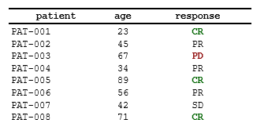

### `c_merge()`: Conditional Cell Merging

Merge multiple columns into a single display cell:

``` r
data_groups <- data.frame(
  group = c("Treatment A", "Treatment A", "Treatment A",
            "Placebo", "Placebo"),
  visit = c("Week 0", "Week 4", "Week 8", "Week 0", "Week 4"),
  value = c(5.2, 6.1, 7.3, 4.8, 5.5)
)

spec <- create_table(data_groups) |>
  compute_cols(
    !firstOf(group),  # Not the first occurrence of this group value
    c_merge(c(group, visit))
  )
```

**Result:** When consecutive rows have the same `group`, their `group`
and `visit` cells merge, displaying the merged content in the `group`
column.

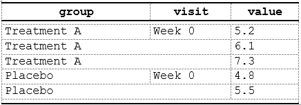

**Note:** The `cols` argument to
[`c_merge()`](https://example.com/reference/c_merge.md) must resolve to
at least two **consecutive** columns in the final report column order.
The value shown in the merged cell is taken **from the first** column in
the `cols` sequence.

### `c_addrow()`: Conditional Row Insertion

Insert new rows based on data patterns:

``` r
spec <- create_table(data_groups) |>
  compute_cols(
    firstOf(group),  # First row of each group
    c_addrow(pos = "above")  # Insert an empty separator/header row above
  )
```

**Result:** An empty separator row is inserted above each new group. To
copy a single column’s value into the inserted row use `value_from` (see
later examples). Use `pos = "below"` to insert after the matching row
instead.

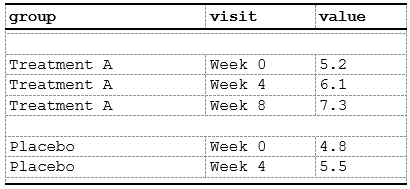

### `c_pageBreak()`: Conditional Page Break

Insert a page break at the matching row. This is useful to force a new
page when a logical grouping or large block ends.

``` r
spec <- create_table(data_groups) |>
  compute_cols(
    firstOf(group),  # Insert page break starting from first row of each group
    c_pageBreak()
  )
```

**Result:** The renderer will start a new page at rows matching the
condition:

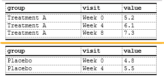

## Evaluation Context

### The Data Environment

Conditions and actions are evaluated in `spec$.metadata$data_env`, which
contains:

1.  **Data columns**: Direct access to all columns (even invisible ones)
2.  **Helper functions**: `firstOf()`, `lastOf()`, `firstRow()`,
    `lastRow()`, `rowNumber()`, `everyNth()`, `firstOfBlock()`
3.  **Embedded functions**: Internal utilities for column access

> **Important**: These helper functions are only available inside the
> `cond` argument of
> [`compute_cols()`](https://example.com/reference/compute_cols.md).
> **They are not standalone exported functions** — you cannot call them
> outside of
> [`compute_cols()`](https://example.com/reference/compute_cols.md).

``` r
# You can reference any column directly in conditions
spec <- create_table(data) |>
  compute_cols(
    age > 60 & response %in% c("CR", "PR"),  # Multi-column condition
    c_style(c(age, response), styleRef = f_combine('b', 'bg_mint'))
  )
```

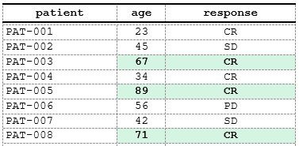

### Available Helper Functions

The following helpers are available exclusively inside
[`compute_cols()`](https://example.com/reference/compute_cols.md)
conditions:

- **`firstOf(...)`**: Logical vector marking first occurrence of each
  value combination in specified columns
- **`lastOf(...)`**: Logical vector marking last occurrence of each
  value combination in specified columns
- **`firstRow()`**: Logical vector TRUE only at first row
- **`lastRow()`**: Logical vector TRUE only at last row
- **`rowNumber()`**: Integer vector of row numbers (1-based)
- **`everyNth(n)`**: Logical vector TRUE at every nth row
- **`firstOfBlock(col, n, offset)`**: Returns logical vector marking
  first row of every n-th block defined by `col`

``` r
# Highlight first and last rows using helper functions
spec <- create_table(data) |>
  compute_cols(
    firstRow() | lastRow(),
    c_style(everything(), styleRef = "border_emphasis")
  )

# Use firstOf/lastOf for value-based boundaries
spec <- create_table(data_groups) |>
  add_style(id = "group_boundary", s_font(bold = TRUE)) |>
  compute_cols(
    firstOf(group) | lastOf(group),
    c_style(group, styleRef = "group_boundary")
  )

# Use everyNth for alternating patterns
spec <- create_table(data) |>
  add_style(id = "gray_bg", s_table_style(background_color = "#F5F5F5")) |>
  compute_cols(
    everyNth(2),  # Every 2nd row starting from row 1
    c_style(everything(), styleRef = "gray_bg")
  )
```

## Advanced `c_style()` Patterns

### Multiple Column Styling

Use tidyselect to style multiple columns at once:

``` r
data_lab <- data.frame(
  patient = sprintf("PAT-%03d", 1:10),
  hemoglobin = rnorm(10, 13.5, 1.5),
  glucose = rnorm(10, 95, 15),
  cholesterol = rnorm(10, 200, 30)
)

spec <- create_table(data_lab) |>
  add_style(id = "out_of_range", s_font(color = "#FF4500", bold = TRUE)) |>
  compute_cols(
    hemoglobin < 12 | hemoglobin > 16,
    c_style(hemoglobin, styleRef = "out_of_range")
  ) |>
  compute_cols(
    glucose < 70 | glucose > 140,
    c_style(glucose, styleRef = "out_of_range")
  ) |>
  compute_cols(
    cholesterol > 240,
    c_style(cholesterol, styleRef = "out_of_range")
  )
```

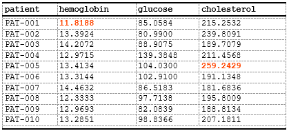

### Conditional Styling with Complex Logic

Combine multiple conditions:

``` r
spec <- create_table(data) |>
  add_style(id = "critical_senior",
            s_font(color = "#8B0000", bold = TRUE),
            s_table_style(background_color = "#FFEBCD")) |>
  compute_cols(
    age >= 60 & response == "PD",
    c_style(c(patient, age, response), styleRef = "critical_senior")
  )
```

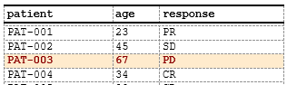

### Row-Level Styling

Style entire rows by targeting all columns:

``` r
spec <- create_table(data) |>
  add_style(id = "alternate_row",
            s_table_style(background_color = "#F0F0F0")) |>
  compute_cols(
    rowNumber() %% 2 == 0,  # Even rows
    c_style(everything(), styleRef = "alternate_row")
  )
```

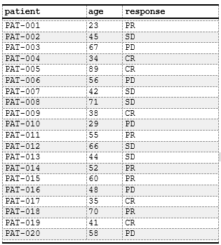

## Advanced `c_merge()` Patterns

### Multi-Column Grouping Merges

Merge across multiple grouping levels:

``` r
data_nested <- data.frame(
  study = rep(c("Study A", "Study B"), each = 6),
  phase = rep(c("Phase I", "Phase II", "Phase III"), 4),
  site = rep(c("Site 1", "Site 2", "Site 1", "Site 2"), 3),
  enrollment = sample(10:50, 12)
)

spec <- create_table(data_nested) |>
  # Merge study column for consecutive same-study rows
  compute_cols(
    !firstOf(study),
    c_merge(c(study, phase, site))
  ) |>
  # Merge phase column within same study
  compute_cols(
    !firstOf(study, phase),
    c_merge(c(phase, site))
  )
```

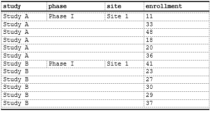

### Conditional Display Column Content

### Merging with Styling

Combine merging with conditional styles:

``` r
spec <- create_table(data_nested) |>
  add_style(id = "merged_header",
            s_font(bold = TRUE),
            s_table_style(background_color = "#E0E0E0")) |>
  compute_cols(
    !firstOf(study),
    c_merge(c(study, phase, site))
  ) |>
  compute_cols(
    firstOf(study),  # First row of group
    c_style(study, styleRef = "merged_header")
  )
```

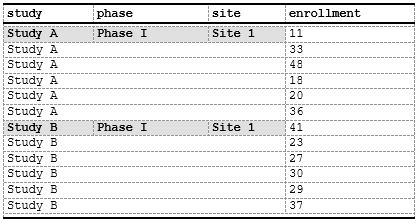

## Advanced `c_addrow()` Patterns

### Summary Rows

Insert calculated summary rows:

``` r
data_sales <- data.frame(
  region = c("North", "North", "South", "South", "West", "West"),
  product = rep(c("A", "B"), 3),
  revenue = c(100, 150, 200, 120, 180, 160),
  total =   c(250, 250, 320, 320, 340, 340)
)

spec <- create_table(data_sales) |>
  add_style(id = "summary_row",
            s_font(bold = TRUE),
            s_table_style(background_color = "#D3D3D3")) |>
  # we do not need the `total` column itself - set to invisible
  define_cols(total, isVisible = F) |> 
  compute_cols(
    lastOf(region),  # Last row of each region
    # Insert subtotal row
    c_addrow(pos = "below", 
             value_from = total, #value from total column
             styleRef = f_combine("summary_row", 'ar'))  
  )
```

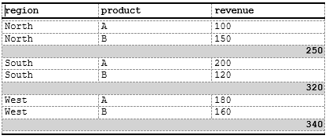

### Header Rows

Insert section (group) headers to make a stub:

``` r

data_sales <- data.frame(
  region = c("North", "North", "South", "South", "West", "West"),
  product = rep(c("Gas", "Oil"), 3),
  revenue = c(100, 150, 200, 120, 180, 160)
)

spec <- create_table(data_sales) |>
  # Custom style just for fun
  add_style(id = "section_header",
            s_font(bold = TRUE, font_size = "10pt", color = '#FFFFFF'),
            s_table_style(background_color = "#4682B4")) |>
  # Hide the `region` column as we want to use its value as heading
  define_cols(region, isVisible = F) |>
  # Add column labels:
  define_cols(
    c(product, revenue),
    label = c('Region<br>  Product', 'Revenue<br>(Million of $)'),
    # Use embedded indent style to indent the `product` value in a column
    valueStyleRef = c('indent_1', NA) # NA here means we are not using any style for `revenue`
  ) |>
  # Use `c_addrow` to add a line with the value from `region` column
  compute_cols(
    firstOf(region),  # First row of each new region
    c_addrow(pos = "above", 
             value_from = region,
             styleRef = "section_header")
  )
```

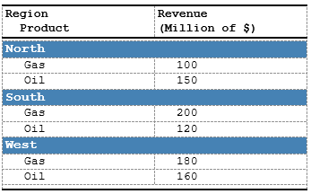

More complex example with two-level indents:

``` r

data_sales <- data.frame(
  region = c("North", "North", "North", "South", "South", "South", "West", "West", "West"), 
  product = rep(c("Total","Gas", "Oil"), 3),
  revenue = c(250, 100, 150, 320, 200, 120, 340, 180, 160)
)


spec <- create_table(data_sales) |>
  # Hide the `region` column as we want to use its value as heading
  define_cols(region, isVisible = F) |>
  # Add column labels:
  define_cols(
    c(product, revenue),
    label = c('Region<br>    Product', 'Revenue<br>(Million of $)'),
    # Use embedded indent style to indent the `product` value in a column
  ) |>
  # Use `c_addrow` to add a line with the value from `region` column
  compute_cols(
    firstOf(region),  # First row of each new region
    c_addrow(pos = "above",  
             value_from = region,
             styleRef = 'b')
  ) |>
  # the `Total` value will be indented 0.5cm
  compute_cols(
    product == 'Total',
    c_style(product, f_combine('i', 'indent_1')),
    c_style(revenue, 'i')
  ) |>
  # Other values ('Gas', 'Oil') will be indented by 1cm
  compute_cols(
    product != 'Total',
    c_style(product, 'indent_2') 
  ) 
```

As a result we are getting two-level stub:

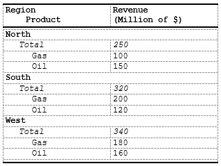

## `c_glue()`: Append or Prepend Text to Cell Values

[`c_glue()`](https://example.com/reference/c_glue.md) concatenates a
literal string or a data column value to the display text of matching
cells — useful for appending units, prefixing markers, or building
composite labels without creating extra columns.

**Parameters:**

\- `cols`: columns to modify (tidyselect)

\- `position`: `"before"` or `"after"` — where to attach the text

\- `glue_col`: name of a data column whose value to attach (mutually
exclusive with `text`)

\- `text`: a literal string to attach (mutually exclusive with
`glue_col`)

\- `separator`: string inserted between original value and the glued
text (default `NULL`)

``` r
data_units <- data.frame(
  parameter = c("Hemoglobin", "Glucose", "Cholesterol"),
  value     = c(13.5,          95.0,      200.0),
  unit      = c("g/dL",        "mg/dL",   "mg/dL")
)

spec <- create_table(data_units) |>
  # Hide the unit column — use it only as a glue source
  define_cols(unit, isVisible = FALSE) |>
  # Append unit to value: "13.5" → "13.5 g/dL"
  compute_cols(
    !is.na(value),
    c_glue(value, position = "after", glue_col = unit, separator = " ")
  )
```

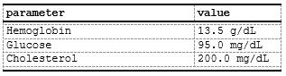

[`c_glue()`](https://example.com/reference/c_glue.md) is fully
compatible with [`c_style()`](https://example.com/reference/c_style.md)
and [`c_merge()`](https://example.com/reference/c_merge.md) in the same
[`compute_cols()`](https://example.com/reference/compute_cols.md) call.

------------------------------------------------------------------------

## `c_clear()`: Blank Cell Content in Matching Rows

[`c_clear()`](https://example.com/reference/c_clear.md) renders
specified cells as empty (blank) in matching rows without removing the
column or affecting layout. Useful for conditional deduplication, when a
`dedupe` parameter of `define_col()` is not enough.

``` r
data_groups <- data.frame(
  group  = c("Treatment A", "Treatment A", "Treatment A", "Placebo", "Placebo"),
  visit  = c("Week 0", "Week 4", "Week 8", "Week 0", "Week 4"),
  value  = c(5.2, 6.1, 7.3, 4.8, 5.5)
)

spec <- create_table(data_groups) |>
  # Show group label only on first row of each group; blank it on the rest
  compute_cols(
    !firstOf(group),
    c_clear(group)
  )
```

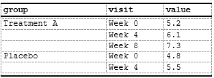

**Note:** [`c_clear()`](https://example.com/reference/c_clear.md) only
affects the rendered display text. The underlying data value is still
available for conditions in other
[`compute_cols()`](https://example.com/reference/compute_cols.md) calls.

------------------------------------------------------------------------

## Combining Actions Together

Chain multiple
[`compute_cols()`](https://example.com/reference/compute_cols.md) calls
and `c_*` actions to build a fully formatted table:

``` r
data_sales <- data.frame(
  region = c("North", "North", "North", 
             "South", "South", "South", 
             "West", "West", "West"),
  product = rep(c("Oil", "Gas", "TOTAL"), 3),
  revenue = c(100, 150, 250, 200, 120, 320, 180, 160, 340)
)

spec <- create_table(data_sales) |>
  add_style(id = "section_header",
            s_font(bold = TRUE, font_size = "11pt", color = '#FFFFFF'),
            s_table_style(background_color = "#4682B4")) |>
  # Make Region invisible, since we want to make it as header row
  define_cols(region, isVisible = F) |>
  # Define column labels
  define_cols(c(product, revenue), label = c('Product', 'Revenue<br>(Million of $)')) |>
  # Make a header row from the `region` value
  compute_cols(
    firstOf(region),  # First row of each new region
    c_addrow(pos = "above", 
             value_from = region,
             styleRef = "section_header")
  ) |> 
  # Create a summary row for `Total` value
  # Note here how a consecutive calls to `c_*` atomic functions produce final result
  compute_cols(
    product == 'TOTAL',
    # merge `product` and `revenue` to a single column (the value became value from `product`)
    c_merge(c(product, revenue), styleRef = f_combine('b','i','bt_th','ar')), 
    # clear the value, since we want to rebuild it:
    c_clear(product),
    # take the value of `region` to the merged cells..
    c_glue(product, 'after', region),
    # add the word 'total' ...
    c_glue(product, 'after', text = ' total: '),
    # and add the value for `revenue` column to get the final string
    c_glue(product, 'after', revenue)
  ) 
```

Here we can see how a simple planar data frame:

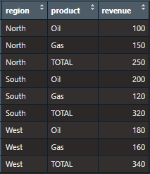

become a production ready table:  
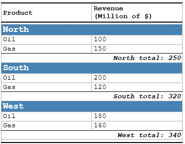

## Performance Tips

### 1. Minimize `compute_cols()` Calls

Each call adds evaluation overhead. Combine conditions when possible:

``` r
# ❌ Less efficient:
spec <- create_table(data) |>
  compute_cols(age < 30, c_style(age, styleRef = "young")) |>
  compute_cols(age >= 30 & age < 60, c_style(age, styleRef = "middle")) |>
  compute_cols(age >= 60, c_style(age, styleRef = "senior"))

# ✅ More efficient (single pass with case_when logic):
spec <- create_table(data) |>
  add_style(id = "young",  s_font(color = "#008000")) |>
  add_style(id = "middle", s_font(color = "#0000FF")) |>
  add_style(id = "senior", s_font(color = "#FF0000")) |>
  compute_cols(
    age < 30,
    c_style(age, styleRef = "young")
  ) |>
  compute_cols(
    age >= 30 & age < 60,
    c_style(age, styleRef = "middle")
  ) |>
  compute_cols(
    age >= 60,
    c_style(age, styleRef = "senior")
  )
  
# Note: Consider refactoring to reduce compute_cols() calls if performance is critical
```

### 2. Use Vectorized Conditions

Avoid row-by-row operations in custom functions:

``` r
# ❌ Slower (scalar logic):
spec <- create_table(data) |>
  compute_cols(
    sapply(response, function(x) x %in% c("CR", "PR")),  # Row-by-row
    c_style(response, styleRef = "responder")
  )

# ✅ Faster (vectorized):
spec <- create_table(data) |>
  compute_cols(
    response %in% c("CR", "PR"),  # Vectorized
    c_style(response, styleRef = "responder")
  )
```

### 3. Pre-Filter Data When Possible

If conditions apply to a small subset, consider filtering data upfront:

``` r
# If only 5% of rows need special formatting:
# Consider creating separate tables and combining in report

data_outliers <- subset(data, age > 80)
data_normal <- subset(data, age <= 80)

spec_outliers <- create_table(data_outliers) |>
  add_style(id = "outlier", s_font(color = "#FF0000", bold = TRUE)) |>
  compute_cols(TRUE, c_style(everything(), styleRef = "outlier"))

spec_normal <- create_table(data_normal)

# Combine in report
report <- create_report(spec_normal, spec_outliers)
```

### 4. Style Consolidation

ksTFL automatically consolidates identical styles, but you can help by
reusing style references:

``` r
# ✅ Define once, use many times:
spec <- create_table(data) |>
  add_style(id = "critical", s_font(color = "#FF0000", bold = TRUE)) |>
  compute_cols(age > 80, c_style(age, styleRef = "critical")) |>
  compute_cols(response == "PD", c_style(response, styleRef = "critical"))

# ❌ Avoid duplicate style definitions:
# (This creates two identical but separate styles)
spec <- create_table(data) |>
  add_style(id = "critical_age",      s_font(color = "#FF0000", bold = TRUE)) |>
  add_style(id = "critical_response", s_font(color = "#FF0000", bold = TRUE))
```

## Debugging and Inspection

### Viewing Captured Actions

Inspect what
[`compute_cols()`](https://example.com/reference/compute_cols.md) has
stored:

``` r
spec <- create_table(data) |>
  compute_cols(
    age > 60,
    c_style(age, styleRef = "elderly")
  )

# Examine metadata
str(spec$.metadata$compute_cols)
# Shows captured quosures and action types
```

### Testing Conditions Manually

Test conditions on your data frame before adding to spec:

``` r
# Test your condition directly on the data before passing to compute_cols()
test_condition <- with(data, age > 60)
sum(test_condition)   # How many rows match?
data[test_condition, ]  # Which rows?

# Once confirmed, add to spec
spec <- spec |>
  compute_cols(age > 60, c_style(age, styleRef = "elderly"))
```

### Incremental Building

Add [`compute_cols()`](https://example.com/reference/compute_cols.md)
one at a time and inspect results:

``` r
spec <- create_table(data)

# Add first action
spec <- spec |>
  compute_cols(age > 60, c_style(age, styleRef = "elderly"))
print(spec)  # Check structure

# Add second action
spec <- spec |>
  compute_cols(response == "CR", c_style(response, styleRef = "success"))
print(spec)  # Check again
```

## Common Patterns Library

### Pattern 1: Alternating Row Colors

``` r
spec <- create_table(data) |>
  add_style(id = "gray_bg", s_table_style(background_color = "#F5F5F5")) |>
  compute_cols(
    rowNumber() %% 2 == 0,
    c_style(everything(), styleRef = "gray_bg")
  )
```

### Pattern 2: Grouped Section Headers with Merging

``` r
spec <- create_table(data_groups) |>
  add_style(id = "group_header",
            s_font(bold = TRUE, font_size = "11pt"),
            s_table_style(background_color = "#D0D0D0")) |>
  # Insert header row before each new group
  compute_cols(
    firstOf(group),
    c_addrow(pos = "above", styleRef = "group_header")
  ) |>
  # Merge consecutive same-group cells
  compute_cols(
    !firstOf(group),
    c_merge(c(group, visit))
  )
```

### Pattern 3: Conditional Highlighting with Thresholds

``` r
spec <- create_table(data_lab) |>
  add_style(id = "low",    s_font(color = "#0000FF")) |>
  add_style(id = "normal", s_font(color = "#008000")) |>
  add_style(id = "high",   s_font(color = "#FF0000")) |>
  compute_cols(
    hemoglobin < 12,
    c_style(hemoglobin, styleRef = "low")
  ) |>
  compute_cols(
    hemoglobin >= 12 & hemoglobin <= 16,
    c_style(hemoglobin, styleRef = "normal")
  ) |>
  compute_cols(
    hemoglobin > 16,
    c_style(hemoglobin, styleRef = "high")
  )
```

### Pattern 4: Summary Rows with Totals

``` r
spec <- create_table(data_sales) |>
  add_style(id = "total_row",
            s_font(bold = TRUE),
            s_table_style(background_color = "#FFD700")) |>
  compute_cols(
    lastOf(region),  # Last row of each region
    c_addrow(pos = "below", styleRef = "total_row")
  )
```

## Limitations and Workarounds

### Limitation 1: No Direct Aggregate Functions in Conditions

You can’t use [`sum()`](https://rdrr.io/r/base/sum.html),
[`mean()`](https://rdrr.io/r/base/mean.html), etc. directly in
conditions:

``` r
# ❌ This won't work as expected:
spec <- create_table(data) |>
  compute_cols(
    age > mean(age),  # Evaluates mean() at condition capture, not evaluation
    c_style(age, styleRef = "above_average")
  )
```

**Workaround:** Pre-calculate and add as a column:

``` r
data$age_above_avg <- data$age > mean(data$age)

spec <- create_table(data) |>
  compute_cols(
    age_above_avg,
    c_style(age, styleRef = "above_average")
  )
```

### Limitation 2: No Nested `c_*()` Functions

You can’t nest action functions:

``` r
# ❌ This is invalid:
spec <- create_table(data) |>
  compute_cols(
    age > 60,
    c_style(age, styleRef = c_merge(patient, age))  # Not allowed
  )
```

**Workaround:** Use separate
[`compute_cols()`](https://example.com/reference/compute_cols.md) calls:

``` r
spec <- create_table(data) |>
  compute_cols(age > 60, c_style(age, styleRef = "elderly")) |>
  compute_cols(age > 60, c_merge(c(patient, age)))
```

### Limitation 3: Style References Must Exist

`styleRef` must reference a previously defined style:

``` r
# ❌ This will error at evaluation time:
spec <- create_table(data) |>
  compute_cols(age > 60, c_style(age, styleRef = "undefined_style"))
```

**Workaround:** Always define styles before using them:

``` r
spec <- create_table(data) |>
  add_style(id = "elderly", s_font(bold = TRUE)) |>  # Define first
  compute_cols(age > 60, c_style(age, styleRef = "elderly"))
```

## Integration with Other ksTFL Features

### Using with `define_cols()`

[`compute_cols()`](https://example.com/reference/compute_cols.md) works
alongside column definitions:

``` r
spec <- create_table(data) |>
  define_cols(age, type = "numeric", format = "0.0", colWidth = "15%") |>
  compute_cols(
    age > 65,
    c_style(age, styleRef = "elderly")
  )
```

### Using with Invisible Columns

Reference invisible columns in conditions:

``` r
data$flag <- sample(c(TRUE, FALSE), nrow(data), replace = TRUE)

spec <- create_table(data) |>
  define_cols(flag, isVisible = FALSE) |>  # Hide column
  compute_cols(
    flag == TRUE,  # But use it in condition
    c_style(response, styleRef = "flagged")
  )
```

### Using in Multi-Spec Reports

Each spec can have independent
[`compute_cols()`](https://example.com/reference/compute_cols.md) logic:

``` r
spec1 <- create_table(data[1:10, ]) |>
  add_style(id = "elderly", s_font(bold = TRUE)) |>
  compute_cols(age > 60, c_style(age, styleRef = "elderly"))

spec2 <- create_table(data[11:20, ]) |>
  add_style(id = "success", s_font(bold = TRUE)) |>
  compute_cols(response == "CR", c_style(response, styleRef = "success"))

report <- create_report(spec1, spec2)
```

## Best Practices

1.  **Define styles first**: Use
    [`add_style()`](https://example.com/reference/add_style.md) before
    [`compute_cols()`](https://example.com/reference/compute_cols.md)
2.  **Test conditions incrementally**: Add one
    [`compute_cols()`](https://example.com/reference/compute_cols.md) at
    a time
3.  **Use meaningful style names**: “elderly” is clearer than “style1”
4.  **Document complex logic**: Add comments explaining condition
    rationale
5.  **Prefer vectorized operations**: Avoid row-by-row functions where
    possible
6.  **Reuse styles**: Define once, reference many times for consistency
7.  **Keep conditions simple**: Complex logic is harder to debug
8.  **Use helper functions**: `firstOf()`, `lastOf()`, `firstRow()`,
    `lastRow()` are more readable than complex comparisons

## Summary

- **[`compute_cols()`](https://example.com/reference/compute_cols.md)**:
  Captures conditions and actions via lazy evaluation
- **[`c_style()`](https://example.com/reference/c_style.md)**: Apply
  conditional styling to cells
- **[`c_merge()`](https://example.com/reference/c_merge.md)**: Merge
  cells across columns based on conditions
- **[`c_addrow()`](https://example.com/reference/c_addrow.md)**: Insert
  new rows dynamically (`pos = "above"` or `"below"`)
- **[`c_pageBreak()`](https://example.com/reference/c_pageBreak.md)**:
  Insert a page break at the matching row
- **[`c_clear()`](https://example.com/reference/c_clear.md)**: Blank the
  rendered display text of specified cells in matching rows
  (deduplication)
- **Evaluation context**: Data environment with helper functions
  (`firstOf()`, `lastOf()`, `firstRow()`, `lastRow()`, `rowNumber()`,
  `everyNth()`, `firstOfBlock()`)
- **Performance**: Minimize calls, use vectorized operations,
  consolidate styles
- **Debugging**: Inspect metadata, test conditions manually, build
  incrementally

For more information, see:

- [Getting
  Started](https://example.com/articles/Getting_Started_with_ksTFL.Rmd)
  — full pipeline overview and
  [`compute_cols()`](https://example.com/reference/compute_cols.md)
  introduction
- [Styling
  Guide](https://example.com/articles/Styling_Guide_with_ksTFL.Rmd) —
  styling fundamentals and built-in atoms
- [Reporting
  Examples](https://example.com/articles/Reporting_Examples_with_ksTFL.Rmd)
  — complete end-to-end workflows
- [Column Width
  Management](https://example.com/articles/Column_Width_Management.Rmd)
  — invisible columns for conditional logic
