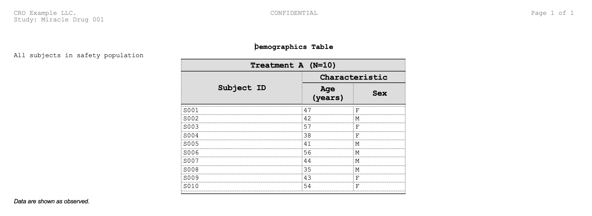

# Getting Started with ksTFL


## Introduction

**What is ksTFL?**

ksTFL is a lightweight R toolkit for building metadata specifications
for clinical Tables, Figures, and Text (TFLs). Unlike traditional table
formatters (flextable, huxtable, officer), ksTFL separates *metadata
generation* from *rendering*:

\- **You define**: Document structure, content, column formats, and
styles in R

\- **ksTFL generates**: A structured specification (JSON metadata + data
files)

\- **Built-in C++ renderer**: Produces submission-quality DOCX documents
with deterministic HarfBuzz-based pagination via
[`write_doc()`](https://example.com/reference/write_doc.md) /
[`replay_report()`](https://example.com/reference/replay_report.md)

This separation enables:

\- **Consistency**: All tables follow the same style templates

\- **Automation**: Generate 50+ tables with consistent formatting and
minimal code

\- **Reproducibility**: Specifications are version-controllable and
auditable

\- **Flexibility**: Swap renderers without changing your R code

**When to use ksTFL:**

\- Regulatory clinical reporting (FDA, EMA submissions) - Large-scale
automated reporting (100+ tables from common data sources)

\- Complex styling requirements (multi-level headers, spanning columns,
conditional formatting) - When you need JSON metadata for downstream
processing

## How to use this guide

This is the foundation vignette and best starting point for new users.

- Audience: users building first end-to-end TFL workflows
- Focus: core objects (`TFL_spec`, `TFL_report`), function flow, and
  minimal working examples
- Outcome: ability to create, assemble, and render reports confidently

Recommended reading order after this vignette:

1\. [Reporting
Examples](https://example.com/articles/Reporting_Examples_with_ksTFL.Rmd)
for realistic workflow patterns.

2\. [Styling
Guide](https://example.com/articles/Styling_Guide_with_ksTFL.Rmd) for
style primitives and reusable style systems.

3\. [Column Width
Management](https://example.com/articles/Column_Width_Management.Rmd)
for layout tuning.

4\. [Advanced
StyleRows](https://example.com/articles/Advanced_StyleRows.Rmd) for
conditional row actions.

5\. [Font Management](https://example.com/articles/Font_Management.Rmd)
for system font discovery, custom font directories, and fallback
behavior.

6\. [Rendering
Pipeline](https://example.com/articles/Rendering_Pipeline.Rmd) for
detailed C++ architecture and DOCX emission internals.

------------------------------------------------------------------------

## General workflow

### High-level pipeline

    Data Frame / Image File
           ↓
    create_table() / create_figure() / create_text()
           ↓
    TFL_spec (customize with define_cols(), add_style(), add_title(), compute_cols())
           ↓
    create_report() (assemble specs, consolidate styles)
           ↓
    TFL_report
           ↓
    write_doc()  ← recommended: one-step save + render
      or
    save_report() → replay_report()  ← two-step: inspect JSON before rendering
           ↓
    Styled .docx (C++ engine, deterministic HarfBuzz pagination)

### Anatomy of a TFL spec

Each `TFL_spec` contains:

| Component       | Purpose                                                                               | How to modify                                                                                                                            |
|-----------------|---------------------------------------------------------------------------------------|------------------------------------------------------------------------------------------------------------------------------------------|
| **document**    | Metadata (docType, title, page settings)                                              | [`set_document()`](https://example.com/reference/set_document.md), [`set_page_style()`](https://example.com/reference/set_page_style.md) |
| **columns**     | Column definitions, labels, formats, styles                                           | [`define_cols()`](https://example.com/reference/define_cols.md)                                                                          |
| **stubColumns** | Spanning headers above column groups                                                  | [`add_span_header()`](https://example.com/reference/add_span_header.md)                                                                  |
| **headers**     | Page header text (left/center/right)                                                  | [`add_header()`](https://example.com/reference/add_header.md)                                                                            |
| **titles**      | Main document titles                                                                  | [`add_title()`](https://example.com/reference/add_title.md)                                                                              |
| **subtitles**   | Secondary titles                                                                      | [`add_subtitle()`](https://example.com/reference/add_subtitle.md)                                                                        |
| **bodyText**    | Narrative content                                                                     | [`add_body_text()`](https://example.com/reference/add_body_text.md)                                                                      |
| **footnotes**   | Document footnotes                                                                    | [`add_footnote()`](https://example.com/reference/add_footnote.md)                                                                        |
| **footers**     | Page footer text                                                                      | [`add_footer()`](https://example.com/reference/add_footer.md)                                                                            |
| **styles**      | Named styles defined with [`add_style()`](https://example.com/reference/add_style.md) | [`add_style()`](https://example.com/reference/add_style.md)                                                                              |

------------------------------------------------------------------------

## Quick 5-minute example

Get a working spec in 5 minutes:

``` r
library(ksTFL)

# 1. Create a table spec from data
spec <- create_table(mtcars, cols = c(mpg, cyl, hp))

# 2. Define a style and apply it
spec <- add_style(spec, id = "header_bold",
  s_font(bold = TRUE, font_size = "12pt"))

# 3. Customize columns
spec <- define_cols(spec, c(mpg, cyl, hp),
  label = c("MPG", "Cylinders", "HP"),
  type = c("numeric", "numeric", "numeric"),
  format = c("%.1f", "%.0f", "%.0f"),
  labelStyleRef = "header_bold") |>
# 4. Add titles and footnotes
add_title("Motor Trends Dataset") |>
add_footnote("Data from mtcars (1974).")

# 5. Inspect the spec
print(spec)

# 6. Render to DOCX
report <- create_report(spec)
write_doc(report, name = "my_table", outDir = "./output", metaPath = tempdir())
```

------------------------------------------------------------------------

## Step 1: Create a TFL_spec

Choose the document type and initialize:

### Table spec (from data frame)

``` r
# Simple: all columns
spec_tbl <- create_table(mtcars)

# Select specific columns with tidyselect
spec_tbl <- create_table(mtcars, cols = c(mpg, cyl, hp, wt))
```

**What happens**:

\- Data is shadow-copied into the spec’s internal environment (not
modifiable)

\- Columns are auto-analyzed (type detection, width calculation)

\- A `TFL_spec` object is returned ready for customization

**Understanding the `cols` parameter**:

The `cols` argument controls which columns appear in the rendered
document and in what order — it does **not** filter or mutate the input
data frame. Think of it as a *presentation lens*: the full dataset is
still stored inside the spec, but only the columns listed in `cols` are
emitted to the final report.

This distinction matters when you use
[`compute_cols()`](https://example.com/reference/compute_cols.md) later
in the pipeline. Because the original data frame is preserved intact,
[`compute_cols()`](https://example.com/reference/compute_cols.md)
conditions can reference **any** column in the data — including columns
that are **not** listed in `cols` and will never appear in the output.
For example, you might exclude a `flag` column from the report but still
use it to drive conditional styling:

``` r
# Only age, sex, trt go to the document; flag stays hidden
spec <- create_table(demog, cols = c(age, sex, trt))

# But flag is still available for conditional logic
spec <- compute_cols(spec, trt,
  c_style("highlight"),
  when = flag == "Y")
```

The order in which columns are passed to `cols` also determines their
left-to-right order in the rendered table, so `cols` doubles as a
convenient column-reordering mechanism — no need to rearrange the
underlying data frame.

### Figure spec (from image file)

``` r
# From a file path — any image format your renderer supports (PNG, JPEG, etc.)
spec_fig <- create_figure("path/to/plot.png")

# From a ggplot2 object — rendered automatically to a temporary image file
library(ggplot2)
p <- ggplot(mtcars, aes(x = wt, y = mpg)) + geom_point()
spec_fig <- create_figure(p)          # uses configured defaults
spec_fig <- create_figure(p, dpi = 150L) # custom resolution (dpi)

# Control output size/format via options
# tfl_set_options(figureWidth = "8in", figureHeight = "5in", figureDevice = "jpeg")
# spec_fig <- create_figure(p)
```

**What happens**:

\- If a **file path** is given: it is validated (must exist and be
readable); the file is used as-is

\- If a **ggplot2 object** is given: rendered via
[`ggplot2::ggsave()`](https://ggplot2.tidyverse.org/reference/ggsave.html)
to [`tempdir()`](https://rdrr.io/r/base/tempfile.html) using package
defaults (`figureWidth`, `figureHeight`, `figureDevice`); the resulting
path is stored in the spec

\- The `dpi` parameter applies when a ggplot2 object is passed;
width/height/device are configured through package options

\- The image file is copied to `metaPath` when the report is saved

### Text spec (narrative content)

``` r
spec_txt <- create_text()

# Add narrative content
spec_txt <- add_body_text(spec_txt, "This analysis includes all subjects in the safety population.")
```

**What happens**: - Empty spec with no data - Ready for narrative
content via
[`add_body_text()`](https://example.com/reference/add_body_text.md)

------------------------------------------------------------------------

## Step 2: Customize columns (define_cols)

After creating a table spec, customize columns with
[`define_cols()`](https://example.com/reference/define_cols.md):

### Single column

``` r
spec <- define_cols(spec, mpg,
  label = "Miles per Gallon",
  type = "numeric",
  format = "%.1f",
  colWidth = "20%")
```

### Batch update (multiple columns with single values)

``` r
# Apply same label format to all columns
spec <- define_cols(spec, c(mpg, cyl, hp),
  label = c("MPG", "Cylinders", "HP"),
  type = "numeric",        # Recycled to all 3
  format = "%.0f")         # Recycled to all 3
```

### Per-column customization

``` r
# Different format for each column
spec <- define_cols(spec, c(mpg, cyl, hp),
  label = c("MPG", "Cylinders", "HP"),
  type = c("numeric", "numeric", "numeric"),
  format = c("%.1f", "%.0f", "%.0f"))
```

**Key parameters**:

\- `label`: Column header text

\- `type`: “numeric” or “string” (auto-detected if omitted)

\- `format`: Format string (e.g., “%.2f”, “0.00”)

\- `colWidth`: Column width (e.g., “20%”, “2cm”) - When set, column is
locked to that width - Other unlocked columns auto-recalculate to sum to
100% - Disable auto-recalculation with
`tfl_set_options(autoColWidth = FALSE)`

\- `isVisible`: TRUE (default) or FALSE - Set to FALSE to hide column
from output - Invisible columns show width “0.0cm” - Cannot set colWidth
on invisible columns - Invisible columns excluded from width
recalculation

\- `isID`: TRUE if column repeats on page breaks

\- `dedupe`: TRUE to clear consecutive repeating values in a column

\- `isColBreak`: TRUE on a column that needs to be moved on the next
page (break long tables)

\- `labelStyleRef`: Style(s) to apply to column header

\- `valueStyleRef`: Style(s) to apply to cell values

**Hiding Columns**:

``` r
# Hide a column (e.g., for conditional logic that doesn't display)
spec <- create_table(data) |>
  define_cols(group_id, isVisible = FALSE)
  # Result: group_id is hidden, other columns recalculated to fill 100%
```

See [Reporting
Examples](https://example.com/articles/Reporting_Examples_with_ksTFL.Rmd)
for detailed column customization patterns.

------------------------------------------------------------------------

## Step 3: Define styles (add_style)

Create reusable named styles with
[`add_style()`](https://example.com/reference/add_style.md):

``` r
spec <- create_table(mtcars)

# Header style: bold, 12pt, centered, gray background
spec <- add_style(spec, id = "table_header",
  s_font(font_name = "Arial", font_size = "12pt", bold = TRUE),
  s_paragraph(alignment = "center"),
  s_table_style(background_color = "#E0E0E0"))

# Numeric style: right-aligned
spec <- add_style(spec, id = "numeric_right",
  s_paragraph(alignment = "right"))

# Apply to columns
spec <- define_cols(spec, c(mpg, hp),
  labelStyleRef = "table_header",
  valueStyleRef = "numeric_right")
```

**Best practice**: Define styles once, reference by id (name) throughout
your spec. If style needs to be used across many tables define it thru
[`tfl_set_options()`](https://example.com/reference/tfl_set_options.md)
to make it available session-wide.

For comprehensive styling details see [Styling
Guide](https://example.com/articles/Styling_Guide_with_ksTFL.Rmd).

------------------------------------------------------------------------

## Step 4: Add spanning headers (span headers)

Create multi-level headers with
[`add_span_header()`](https://example.com/reference/add_span_header.md)
using tidyselect expressions:

``` r
spec <- create_table(mtcars)
spec <- define_cols(spec, c(mpg, cyl, hp, wt),
  label = c("MPG", "Cyl", "HP", "Weight"))

# Top-level span header spanning all columns
spec <- add_span_header(spec, cols = c(mpg, cyl, hp, wt),
  label = "Motor Vehicle Specs",
  stubOrder = 0) |>
# Second-level headers: finer grouping
add_span_header(cols = c(mpg, cyl, hp),
  label = "Engine",
  stubOrder = 1) |>
add_span_header(cols = wt,
  label = "Weight",
  stubOrder = 1)
```

**Tidyselect support**:
[`add_span_header()`](https://example.com/reference/add_span_header.md)
accepts all tidyselect expressions:

``` r
# Using column ranges and helpers
spec <- add_span_header(spec, cols = mpg:hp, label = "First", stubOrder = 0) |>
  add_span_header(cols = starts_with("c"), label = "C-columns", stubOrder = 1) |>
  add_span_header(cols = -mpg, label = "Non-MPG", stubOrder = 2)
```

**Key concepts**:

\- `cols`: Column names (from `spec$columns`) to span.

Accepts:

\- **Unquoted names**: `c(mpg, cyl, hp)`

\- **Quoted names**: `c("mpg", "cyl", "hp")`

\- **Ranges**: `mpg:hp`

\- **Helpers**: `starts_with("c")`, `contains("w")`, `matches("^m")`

\- **Negation**: `-mpg` (all columns except mpg)

\- `label`: Spanning header text

\- `stubOrder`: Vertical stacking order (1 = top, 2 = next, etc.;
auto-generated if NULL)

\- `labelStyleRef`: Style(s) for the header label

**Rules**:

\- Stubs at the **same** `stubOrder` cannot share columns (prevents
ambiguous headers)

\- Stubs at **different** `stubOrder` values can overlap freely (enables
hierarchical structure)

\- Multiple stubs at the same order are allowed as long as their column
sets don’t overlap

\- Use [`add_style()`](https://example.com/reference/add_style.md) to
style stub labels or use embedded atomic styles

See [Styling
Guide](https://example.com/articles/Styling_Guide_with_ksTFL.Rmd) for
styling stubs.

------------------------------------------------------------------------

## Step 5: Add titles, footnotes, headers, footers

Add document content layers:

``` r
spec <- create_table(mtcars)

# Titles and subtitles
spec <- add_title(spec, "Demographics")
spec <- add_subtitle(spec, "Motor Vehicle Analysis")

# Footnotes (document-level notes)
spec <- add_footnote(spec, "Values are from 1974 Motor Trend magazine.")

# Page headers (left/center/right) — three separate string arguments
spec <- add_header(spec, "Study ABC", "CONFIDENTIAL", "Page {PAGE}")

# Page footers (left/center/right) — three separate string arguments
spec <- add_footer(spec, "Company", "Locked DB", "2025")

# Body text (narrative)
spec <- add_body_text(spec, "This analysis includes all subjects in the safety population.")
```

**Notes**:

\- [`add_header()`](https://example.com/reference/add_header.md) and
[`add_footer()`](https://example.com/reference/add_footer.md) take up to
3 separate string arguments: left, center, right

\- Placeholders like `{PAGE}` and `{NUMPAGES}` are filled in by the
renderer

\- Multiple
[`add_header()`](https://example.com/reference/add_header.md) calls
append additional header rows; use the `level` parameter to replace a
specific row

\- Multiple
[`add_footnote()`](https://example.com/reference/add_footnote.md) calls
stack in order

\- [`add_title()`](https://example.com/reference/add_title.md) and
[`add_subtitle()`](https://example.com/reference/add_subtitle.md) accept
an optional `toclevel` parameter (integer, `1` to `9`). When set, the
title is included in the Table of Contents generated by
`write_doc(toc = TRUE)`. See
[`?add_title`](https://example.com/reference/add_title.md) for details.

------------------------------------------------------------------------

## Step 5b: Page layout and templates

### Page size, orientation, and margins

Use
[`set_page_style()`](https://example.com/reference/set_page_style.md)
with [`p_page()`](https://example.com/reference/p_page.md) and
[`p_margins()`](https://example.com/reference/p_margins.md) to control
the physical page layout:

``` r
spec <- create_table(mtcars) |>
  set_page_style(
    page = p_page(
      size        = "A4",        # "A4", "Letter", or "Legal"
      orientation = "landscape",  # "portrait" or "landscape"
      margins     = p_margins(
        top    = "1in",
        bottom = "1in",
        left   = "0.75in",
        right  = "0.75in",
        header = "0.5in",
        footer = "0.5in"
      )
    )
  )
```

**[`p_page()`](https://example.com/reference/p_page.md) parameters**:

\- `size`: Page size — `"A4"` (default), `"Letter"`, or `"Legal"`

\- `orientation`: `"portrait"` (default) or `"landscape"`

\- `margins`: A margins object from
[`p_margins()`](https://example.com/reference/p_margins.md)

**[`p_margins()`](https://example.com/reference/p_margins.md)
parameters** (all accept dimension strings like `"1in"`, `"2.54cm"`,
`"72pt"`, `"25.4mm"`):

\- `top`, `bottom`, `left`, `right`: Page margins

\- `header`, `footer`: Distance from page edge to header/footer content

### Document templates

Templates control the visual appearance (colours, fonts, borders) of the
rendered DOCX:

``` r
# List all bundled templates
tfl_list_templates()

# Apply a bundled template
spec <- create_table(mtcars) |>
  set_page_style(docTemplate = "Navy_Pro")

# Or apply via set_document()
spec <- create_table(mtcars) |>
  set_document(hasData = TRUE, docTemplate = "Carbon_Dark")

# Use a custom external template (JSON file)
spec <- create_table(mtcars) |>
  set_page_style(docTemplate = "path/to/my_custom_template.json")
```

Use
[`run_styles_editor()`](https://example.com/reference/run_styles_editor.md)
to interactively create and edit template JSON files.

------------------------------------------------------------------------

## Step 6: Combine specs into a report

Assemble multiple specs with
[`create_report()`](https://example.com/reference/create_report.md):

``` r
# Create multiple specs
spec_table <- create_table(mtcars)
spec_table <- add_title(spec_table, "Table 1: Demographics")

spec_text <- create_text()
spec_text <- add_body_text(spec_text, "Analysis performed in R.")

spec_fig <- create_figure("plots/histogram.png")

# Combine into single report
report <- create_report(spec_table, spec_text, spec_fig)

# Inspect combined report
print(report)
```

**What
[`create_report()`](https://example.com/reference/create_report.md)
does**:

1\. Flattens inputs (supports nested reports)

2\. Validates structure

3\. Consolidates combined styles (if any used
[`f_combine()`](https://example.com/reference/f_combine.md))

4\. Assigns sequential `docOrder` (1, 2, 3, …)

5\. Creates `dataRef` names for new specs

6\. Returns a `TFL_report` object

**Result**: A single report combining all specs in input order.
Additionally a Table of Contents can be auto-generated in such documents
that allows to create a production ready TFL reports.

------------------------------------------------------------------------

## Step 7: Apply conditional row actions (compute_cols)

Beyond global column styling, apply **conditional actions** to specific
rows that match a condition:

``` r
spec <- create_table(mtcars)

# Define a style for first group occurrences
spec <- add_style(spec, id = "group_header", s_font(bold = TRUE, color = "#0000FF"))

# Apply style conditionally: highlight first occurrence of each cyl group
spec <- compute_cols(spec, firstOf(cyl), 
  c_style(c(mpg, hp), styleRef = "group_header"))

# Add a separator row above first group
spec <- compute_cols(spec, firstOf(cyl), 
  c_addrow(pos = "above"))
```

**Common use cases**: - **Highlight group headers**: Style first/last
occurrence of a group - **Add separators**: Insert empty rows between
groups - **Merge columns**: Create group headers by merging columns -
**Conditional formatting**: Style rows meeting a threshold (e.g.,
`value > 100`)

**Key action functions** (used inside
[`compute_cols()`](https://example.com/reference/compute_cols.md)):

| Function                                                        | Purpose                                           | Example                                                         |
|-----------------------------------------------------------------|---------------------------------------------------|-----------------------------------------------------------------|
| `c_style(cols, styleRef)`                                       | Apply style to columns in matching rows           | `c_style(c(mpg, hp), styleRef = "bold")`                        |
| `c_merge(cols, styleRef = NULL)`                                | Merge adjacent columns                            | `c_merge(c(col1, col2), styleRef = "header")`                   |
| `c_addrow(pos, value_from = NULL, styleRef = NULL)`             | Insert row above/below                            | `c_addrow(pos = "above")` for empty separator                   |
| [`c_pageBreak()`](https://example.com/reference/c_pageBreak.md) | Insert a page break at the matching row (no args) | [`c_pageBreak()`](https://example.com/reference/c_pageBreak.md) |

**Condition syntax**:

``` r
# Direct column comparison
compute_cols(spec, cyl > 6, c_style(mpg, styleRef = "emphasize"))

# String matching
compute_cols(spec, Parameter == "Pulse", c_style(value, styleRef = "numeric"))

# Helper functions available INSIDE compute_cols() conditions:
#   firstOf(col1, col2, ...)  — TRUE for first row of each unique combination
#   lastOf(col1, col2, ...)   — TRUE for last row of each unique combination
#   firstRow()                — TRUE only for the very first data row
#   lastRow()                 — TRUE only for the very last data row
#   everyNth(n)               — TRUE every n-th row (1, n+1, 2n+1, ...)
#   rowNumber()               — 1-based row index
#   firstOfBlock(col, n, offset) — first row of every n-th block
# Note: these helpers are NOT standalone functions — they only work inside
# the condition argument of compute_cols().

compute_cols(spec, firstOf(group), c_style(c(col1, col2), styleRef = "group_header"))
compute_cols(spec, lastOf(group), c_addrow(pos = "below"))
compute_cols(spec, everyNth(5), c_style(mpg, styleRef = "zebra"))

# Combine conditions
compute_cols(spec, cyl == 8 & hp > 100, c_style(mpg, styleRef = "high_power"))
```

**Key concepts**:

\- Conditions are evaluated during
[`create_report()`](https://example.com/reference/create_report.md) — at
that point, all data is available

\- Multiple
[`compute_cols()`](https://example.com/reference/compute_cols.md) calls
accumulate on the same spec

\- Actions on the same row from different
[`compute_cols()`](https://example.com/reference/compute_cols.md) blocks
are combined

\- `value_from = NULL` in
[`c_addrow()`](https://example.com/reference/c_addrow.md) creates an
empty separator row

For detailed examples see [Reporting Examples: Conditional Row
Actions](https://example.com/articles/Reporting_Examples_with_ksTFL.Rmd#conditional-row-actions).

------------------------------------------------------------------------

## Step 8: Save and Render

### Option A: One step with `write_doc()` (recommended)

[`write_doc()`](https://example.com/reference/write_doc.md) combines
save + render into a single call:

``` r
report <- create_report(spec_table, spec_text)

# Returns the full path to the generated .docx (invisibly)
doc_path <- write_doc(report,
  name     = "demographics",          # Output file name (no extension)
  outDir   = "./output",              # Where the final .docx is written
  metaPath = tempdir())               # Where JSON metadata is written (temp is fine)
```

**Additional parameters**:

\- `toc`: If `TRUE`, prepends a Table of Contents page (requires
`toclevel` on titles - see
[`?add_title`](https://example.com/reference/add_title.md))

\- `tocTitle`: Heading above the TOC field (default
`"Table of Contents"`)

\- `prettify`: If `TRUE`, writes human-readable JSON (useful for
debugging)

\- `verbose`: If `TRUE`, prints renderer progress messages to R console

This is the recommended approach for production use. Set session
defaults once:

``` r
tfl_set_options(
  output_directory = "./output",
  meta_directory   = "./meta"
)

# Then write_doc() uses those defaults automatically
write_doc(report, name = "demographics")
```

### Option B: Two steps with `save_report()` + `replay_report()`

Use this when you need to inspect or version-control the JSON metadata
separately:

``` r
report <- create_report(spec_table, spec_text)

# Step 1: Serialize to JSON + data files
result <- save_report(report,
  docFileName = "my_report.docx",
  outDir      = "./output",
  metaPath    = tempdir(),
  prettify    = TRUE)              # prettify = TRUE for readable JSON (debugging)

# Step 2: Re-render the DOCX from the saved JSON metadata
replay_report(
  spec_json   = result$spec_file,
  meta_dir    = result$metaPath,
  output_path = file.path("./output", "my_report.docx"))
```

**[`save_report()`](https://example.com/reference/save_report.md) output
files**:

\- `{metaPath}/{spec_hash}.json` — Main specification (consumed by
renderer)

\- `{metaPath}/{dataRef}.json` — Table data files (one per table spec) -
Figure files copied to `metaPath` as-is

------------------------------------------------------------------------

## Step 9: JSON metadata — what it is and why you might need it

### What is the metadata folder?

Every time [`write_doc()`](https://example.com/reference/write_doc.md)
(or [`save_report()`](https://example.com/reference/save_report.md))
runs, it writes intermediate files to `metaPath`:

- **`{hash}.json`** — The main spec file: document structure, column
  definitions, styles, titles, footnotes, headers/footers. This is what
  the C++ renderer reads.
- **`{dataRef}.json`** — One data file per table spec, containing the
  actual row data.
- **Figure files** — Copied from their original paths into `metaPath`.
- **`_index.json`** — An index of all spec files written to this folder
  (auto-maintained).

For most workflows, `metaPath = tempdir()` is fine — you only care about
the final `.docx`. But there are real reasons to use a persistent
`metaPath`.

### Why use a persistent metaPath?

**Reproducibility / audit trail**: In regulated environments (FDA, EMA
submissions), you may need to prove that a specific DOCX was generated
from a specific dataset at a specific time. The spec JSON + data JSON
together form a complete, reproducible snapshot.

**Re-rendering without R**: Once the JSON files exist, you can re-render
the DOCX without any R objects or data frames — just the JSON files.
This is useful for: - Regenerating a document after a template change -
Rendering on a different machine or in a CI/CD pipeline - Reproducing an
output months later

**Version management**: Each
[`write_doc()`](https://example.com/reference/write_doc.md) call writes
a new hash-named spec file. You can keep multiple versions and compare
them.

### Managing metadata files

``` r
meta_dir <- "./meta"

# List all spec JSONs in the meta folder
df <- list_reports(meta_dir)
print(df[df$is_latest, c("doc_file", "datetime", "spec_file")])

# Re-render a DOCX from stored JSON (no R objects needed)
replay_report("demographics.docx", meta_dir = meta_dir)

# Or replay a specific version by spec hash
replay_report("abc123def456.json", meta_dir = meta_dir,
              output_path = "./output/demographics_v2.docx")

# Clean up obsolete spec files (keeps latest version per document)
clean_reports(meta_dir, dry_run = TRUE)   # Preview what would be deleted
clean_reports(meta_dir, dry_run = FALSE)  # Actually delete
```

**[`list_reports()`](https://example.com/reference/list_reports.md)**
returns a data frame with columns: `doc_file`, `datetime`, `is_latest`,
`n_specs`, `spec_file`, `data_refs`.

**[`replay_report()`](https://example.com/reference/replay_report.md)**
re-renders from JSON — no R spec objects, no data frames required. Pass
either the target `.docx` name (re-renders the latest version) or the
exact spec hash filename.

**[`clean_reports()`](https://example.com/reference/clean_reports.md)**
removes obsolete JSON files. By default keeps 1 version per document
(`keep_versions = 1`). Always run with `dry_run = TRUE` first.

### Recommended production setup

``` r
# Set persistent meta directory once per session
tfl_set_options(
  output_directory = "./output",
  meta_directory   = "./meta"   # Persistent — survives session restarts
)

# All write_doc() calls now use these directories automatically
write_doc(report1, name = "tbl_demographics")
write_doc(report2, name = "tbl_labs")

# Later: re-render without R if needed
replay_report("tbl_demographics.docx", meta_dir = "./meta")
```

------------------------------------------------------------------------

## Understanding auto-generated values

### Column widths (auto-calculation)

When you create a table, widths are auto-calculated based on data
characteristics:

``` r
# Auto-calculated widths (example)
# id = 20%, description = 50%, value = 30%
spec <- create_table(my_data)

# Lock id to 15%; others recalculate to fill 85%
spec <- define_cols(spec, id, colWidth = "15%")
```

See [Reporting
Examples](https://example.com/articles/Reporting_Examples_with_ksTFL.Rmd)
for detailed width customization.

### Data references (dataRef)

Each table spec gets a `dataRef` name for its data file:

``` r
# Auto-generated: "0001_abc123def456" (docOrder + hash)
report <- create_report(spec_table1, spec_table2)

# Manual control not needed — handled automatically by write_doc()
write_doc(report, name = "my_report", outDir = "./output", metaPath = "./meta")
```

------------------------------------------------------------------------

## Session-wide defaults with `tfl_options`

Set defaults once, inherited by all new specs:

``` r
# Set session defaults
tfl_set_options(
  add_header("Study ABC", "Locked Database", "CONFIDENTIAL"),
  add_footer("Company Name", "Page {PAGE}", "2025"),
  add_body_text("Analysis performed in R with ksTFL."))

# All new specs created afterward inherit these settings
spec1 <- create_table(data1)  # Automatically gets headers/footers/body text
spec2 <- create_table(data2)  # Also inherits defaults

# Check current options
tfl_get_options()

# Reset to package defaults
tfl_reset_options()
```

------------------------------------------------------------------------

## Complete example: From data to document

``` r
library(ksTFL)

# --- Setup ---
data <- data.frame(
  subject = sprintf("S%03d", 1:10),
  age = round(rnorm(10, 45, 10)),
  sex = sample(c("M", "F"), 10, TRUE)
)

# --- Create & customize ---
spec <- create_table(data, cols = c(subject, age, sex))

spec <- add_style(spec, id = "header",
                  s_font(bold = TRUE, font_size = "11pt"),
                  s_paragraph(alignment = "center"),
                  s_table_style(background_color = "#DDDDDD"))

spec <- define_cols(spec, c(subject, age, sex),
                    label = c("Subject ID", "Age (years)", "Sex"),
                    labelStyleRef = "header")

spec <- define_cols(spec, age, type = "numeric", format = "%.0f")

spec <- add_title(spec, "Demographics Table")
spec <- add_subtitle(spec, "All subjects in safety population")
spec <- add_footnote(spec, "Data are shown as observed.")

spec <- add_span_header(spec, c(age, sex), 'Characteristic', 
                        labelStyleRef = "header", stubOrder = 1)
spec <- add_span_header(spec, c(subject, age, sex), 'Treatment A (N=10)', 
                        labelStyleRef = "header", stubOrder = 2)

spec <- set_document(spec, contentWidth = '40%')

# --- Export ---
report <- create_report(spec) |>  write_doc('demographics')

# Done!
```



## Key gotchas and tips

| Gotcha                                              | Solution                                                                                                                                                                 |
|-----------------------------------------------------|--------------------------------------------------------------------------------------------------------------------------------------------------------------------------|
| **Calling s\_\* helpers outside add_style()**       | Always use s\_\* inside [`add_style()`](https://example.com/reference/add_style.md) — they validate context                                                              |
| **define_cols() with mismatched parameter lengths** | Length must be 1 (recycled) or match number of columns                                                                                                                   |
| **Styles from f_combine() not consolidated**        | Call [`create_report()`](https://example.com/reference/create_report.md) before [`write_doc()`](https://example.com/reference/write_doc.md)                              |
| **Multiple add_header() calls stack**               | Each call **appends** a new header level; use `level =` to replace a specific level                                                                                      |
| **Figure file not found**                           | Check path is absolute or relative to current working directory                                                                                                          |
| **create_text() does not accept data**              | [`create_text()`](https://example.com/reference/create_text.md) takes no arguments — add content via [`add_body_text()`](https://example.com/reference/add_body_text.md) |
| **Overlapping stubs at same stubOrder**             | Error; use different `stubOrder` or non-overlapping column sets                                                                                                          |

------------------------------------------------------------------------

## RStudio Addins

ksTFL ships with five RStudio Addins (available from the **Addins**
drop-down in the RStudio toolbar). They provide interactive shortcuts
for tasks that would otherwise require remembering function names or
switching to the console.

### Styles Editor

Launches a Shiny application for creating and editing style templates
interactively. You can load any bundled template from
[`tfl_list_templates()`](https://example.com/reference/tfl_list_templates.md),
modify fonts, borders, spacing, and colours in a WYSIWYG editor, then
download the result as a JSON file ready for use with
[`set_page_style()`](https://example.com/reference/set_page_style.md) or
[`write_doc()`](https://example.com/reference/write_doc.md). This is
especially useful when you need to fine-tune a template visually rather
than writing [`s_font()`](https://example.com/reference/s_font.md) /
[`s_paragraph()`](https://example.com/reference/s_paragraph.md) /
[`s_table_style()`](https://example.com/reference/s_table_style.md)
calls by hand.

Requires the `shiny` package.

``` r
# Equivalent programmatic call:
run_styles_editor()
```

### Replay Reports

Opens a Shiny application for selecting, reordering, and combining
previously saved reports into a single DOCX document. You point the app
at one or more meta-data folders (produced by
[`save_report()`](https://example.com/reference/save_report.md) or
[`write_doc()`](https://example.com/reference/write_doc.md)),
drag-and-drop reports into the desired order, optionally enable a table
of contents, and render the combined output — all without writing any R
code.

Requires `shiny`, `sortable`, and `shinyFiles` packages.

``` r
# Equivalent programmatic call:
run_replay_app()

# Pre-populate a meta folder:
run_replay_app(meta_dir = "./output/meta")
```

### TFL Spec Preview (Selection)

Evaluates the currently selected code in the source editor and, if the
result is a `TFL_spec`, renders an HTML preview in the RStudio Viewer
pane. This lets you highlight a pipeline expression (e.g.,
`create_table(...) |> add_title(...)`) and instantly see what the spec
looks like — a quick visual check without saving or rendering to DOCX.

### TFL Spec Preview (by name)

Same HTML preview, but instead of evaluating selected text the addin
prompts you for the name of a `TFL_spec` object that already exists in
`.GlobalEnv`. Handy when the spec was built interactively in the console
and you want to preview it without re-selecting code.

### Style Atoms Catalog

Prints all built-in style atoms to the console with colour-coded
categories (font decoration, font family, font size, text colour,
highlight, alignment, indentation, spacing, borders, backgrounds, row
height, and more). Each atom is a short name you can reference directly
in [`add_style()`](https://example.com/reference/add_style.md) or
[`define_cols()`](https://example.com/reference/define_cols.md) via
[`f_combine()`](https://example.com/reference/f_combine.md). Running
this catalog helps you discover what is available without consulting
documentation.

``` r
# Equivalent programmatic call:
tfl_style_atoms_catalog()
# — or —
tfl_print_style_atoms()
```

------------------------------------------------------------------------

## Next steps

You now understand ksTFL’s core workflow. Next steps:

1.  **Run the quick example** above with your own data
2.  **Explore [Reporting
    Examples](https://example.com/articles/Reporting_Examples_with_ksTFL.Rmd)**
    for detailed patterns
3.  **Read [Styling
    Guide](https://example.com/articles/Styling_Guide_with_ksTFL.Rmd)**
    for advanced styling
4.  **Read [Advanced
    StyleRows](https://example.com/articles/Advanced_StyleRows.Rmd)**
    for conditional formatting
5.  **Check function docs**:
    [`?create_table`](https://example.com/reference/create_table.md),
    [`?define_cols`](https://example.com/reference/define_cols.md),
    [`?add_style`](https://example.com/reference/add_style.md),
    [`?write_doc`](https://example.com/reference/write_doc.md),
    [`?list_reports`](https://example.com/reference/list_reports.md)

------------------------------------------------------------------------

## Resources

- **Function reference**:
  [`?ksTFL`](https://example.com/reference/ksTFL-package.md) (package
  overview) or
  [`?create_table`](https://example.com/reference/create_table.md),
  [`?define_cols`](https://example.com/reference/define_cols.md), etc.
- **Reporting Examples**: [Detailed working examples with
  explanations](https://example.com/articles/Reporting_Examples_with_ksTFL.Rmd)
- **Styling Guide**: [Comprehensive style
  reference](https://example.com/articles/Styling_Guide_with_ksTFL.Rmd)
- **GitHub**: [ksTFL repository](https://example.com)

------------------------------------------------------------------------

## Quick reference table

| Task                     | Function                                                                                                                                                                                            | Notes                                                                                                                                                                                                                                                                                                                                                            |
|--------------------------|-----------------------------------------------------------------------------------------------------------------------------------------------------------------------------------------------------|------------------------------------------------------------------------------------------------------------------------------------------------------------------------------------------------------------------------------------------------------------------------------------------------------------------------------------------------------------------|
| Create table spec        | `create_table(data, cols = ...)`                                                                                                                                                                    | Auto-detects columns, types, widths                                                                                                                                                                                                                                                                                                                              |
| Create figure spec       | `create_figure(plot_or_path, dpi = 300L)`                                                                                                                                                           | File path or ggplot2 object; path must be readable                                                                                                                                                                                                                                                                                                               |
| Create text spec         | [`create_text()`](https://example.com/reference/create_text.md)                                                                                                                                     | For narrative content only                                                                                                                                                                                                                                                                                                                                       |
| Set document properties  | `set_document(spec, hasData = ...)`                                                                                                                                                                 | Optional: configure content width, placement                                                                                                                                                                                                                                                                                                                     |
| Customize columns        | `define_cols(spec, cols, ...)`                                                                                                                                                                      | Use [`c()`](https://rdrr.io/r/base/c.html) for multiple columns                                                                                                                                                                                                                                                                                                  |
| Define styles            | `add_style(spec, id = "name", ...)`                                                                                                                                                                 | Use [`s_font()`](https://example.com/reference/s_font.md), [`s_paragraph()`](https://example.com/reference/s_paragraph.md), [`s_table_style()`](https://example.com/reference/s_table_style.md)                                                                                                                                                                  |
| Add spanning header      | `add_span_header(spec, cols, label, ...)`                                                                                                                                                           | Supports tidyselect; multi-level headers                                                                                                                                                                                                                                                                                                                         |
| Add titles/content       | [`add_title()`](https://example.com/reference/add_title.md), [`add_footnote()`](https://example.com/reference/add_footnote.md), [`add_body_text()`](https://example.com/reference/add_body_text.md) | Layer document content                                                                                                                                                                                                                                                                                                                                           |
| Add page headers/footers | [`add_header()`](https://example.com/reference/add_header.md), [`add_footer()`](https://example.com/reference/add_footer.md)                                                                        | 3 parts: left/center/right                                                                                                                                                                                                                                                                                                                                       |
| Conditional row actions  | `compute_cols(spec, cond, ...)`                                                                                                                                                                     | Use [`c_style()`](https://example.com/reference/c_style.md), [`c_merge()`](https://example.com/reference/c_merge.md), [`c_addrow()`](https://example.com/reference/c_addrow.md), [`c_glue()`](https://example.com/reference/c_glue.md), [`c_clear()`](https://example.com/reference/c_clear.md), [`c_pageBreak()`](https://example.com/reference/c_pageBreak.md) |
| Set page style           | `set_page_style(spec, page = p_page(...))`                                                                                                                                                          | Configure page size, orientation, margins                                                                                                                                                                                                                                                                                                                        |
| Page settings helper     | `p_page(size, orientation, margins)`                                                                                                                                                                | `"A4"` / `"Letter"` / `"Legal"`, margins via [`p_margins()`](https://example.com/reference/p_margins.md)                                                                                                                                                                                                                                                         |
| List templates           | [`tfl_list_templates()`](https://example.com/reference/tfl_list_templates.md)                                                                                                                       | Shows all bundled template names                                                                                                                                                                                                                                                                                                                                 |
| Discover style atoms     | [`tfl_print_style_atoms()`](https://example.com/reference/tfl_print_style_atoms.md)                                                                                                                 | Prints all built-in style atoms grouped by category                                                                                                                                                                                                                                                                                                              |
| Font status              | [`tfl_font_status()`](https://example.com/reference/tfl_font_status.md), [`tfl_rescan_fonts()`](https://example.com/reference/tfl_rescan_fonts.md)                                                  | Check or re-run font discovery                                                                                                                                                                                                                                                                                                                                   |
| Combine specs            | `create_report(spec1, spec2, ...)`                                                                                                                                                                  | Consolidates styles, assigns order                                                                                                                                                                                                                                                                                                                               |
| Save + render (one step) | `write_doc(report, name, ...)`                                                                                                                                                                      | Recommended: saves JSON + renders DOCX                                                                                                                                                                                                                                                                                                                           |
| Save only                | `save_report(report, ...)`                                                                                                                                                                          | Writes JSON + data files for manual rendering                                                                                                                                                                                                                                                                                                                    |
| Render from JSON         | `replay_report(spec_json, meta_dir, output_path, overrideTemplate = NULL)`                                                                                                                          | C++ renderer: JSON → styled DOCX                                                                                                                                                                                                                                                                                                                                 |
| Set session defaults     | `tfl_set_options(...)`                                                                                                                                                                              | Inherited by new specs in session                                                                                                                                                                                                                                                                                                                                |
| Check options            | [`tfl_get_options()`](https://example.com/reference/tfl_get_options.md), `tfl_get_option(name)`                                                                                                     | View current session settings                                                                                                                                                                                                                                                                                                                                    |
| Reset options            | [`tfl_reset_options()`](https://example.com/reference/tfl_reset_options.md)                                                                                                                         | Back to package defaults                                                                                                                                                                                                                                                                                                                                         |
