# Reporting Examples using ksTFL


This vignette presents a realistic progression of reporting examples —
from minimal tables/listings/figures/text to a full clinical-style table
with multi-level headers, spanning stub columns, multi-line
titles/footnotes, reusable styles, and session defaults. All examples
use exported ksTFL helpers only; set `eval=TRUE` locally to run the R
chunks.

## Category and scope

This is an applied workflow vignette.

- Audience: users who already know the basic pipeline and want practical
  templates
- Focus: end-to-end report assembly patterns you can adapt directly
- Outcome: production-oriented examples for table, figure, text, and
  multi-spec workflows

**Related vignettes:**

\- [Getting
Started](https://example.com/articles/Getting_Started_with_ksTFL.Rmd) —
pipeline overview and all core concepts

\- [Styling
Guide](https://example.com/articles/Styling_Guide_with_ksTFL.Rmd) —
complete style reference and built-in atoms

\- [Advanced
StyleRows](https://example.com/articles/Advanced_StyleRows.Rmd) — deep
dive into
[`compute_cols()`](https://example.com/reference/compute_cols.md),
[`c_glue()`](https://example.com/reference/c_glue.md),
[`c_clear()`](https://example.com/reference/c_clear.md)

\- [Column Width
Management](https://example.com/articles/Column_Width_Management.Rmd) —
width locking, auto-calculation, invisible columns

## Workflow overview

This vignette follows a consistent end-to-end pattern for each example
so you can reproduce the full reporting pipeline locally:

- Prepare small, self-contained sample data (run the setup chunk with
  `eval=TRUE`).
- Build `TFL_spec` objects using
  [`create_table()`](https://example.com/reference/create_table.md),
  [`create_figure()`](https://example.com/reference/create_figure.md) or
  [`create_text()`](https://example.com/reference/create_text.md).
- Tune columns and styles via
  [`define_cols()`](https://example.com/reference/define_cols.md) and
  [`add_style()`](https://example.com/reference/add_style.md) (use
  [`f_combine()`](https://example.com/reference/f_combine.md) to
  reference combined styles).
- Assemble specs into a `TFL_report` with
  [`create_report()`](https://example.com/reference/create_report.md)
  (this consolidates style references and assigns `dataRef`).
- Render to a DOCX with
  [`write_doc()`](https://example.com/reference/write_doc.md) (one-step:
  saves JSON metadata and produces the final document).

Best practices:

- Use named styles
  ([`add_style()`](https://example.com/reference/add_style.md)) and
  reference them by id; avoid inspecting or mutating internal fields.
- Use `print(spec)` for concise, user-facing previews rather than
  reading internals. Or use package provided Addins
- Use `metaPath = tempdir()` during examples to avoid writing permanent
  files while you experiment.

``` r
# Sample datasets used by multiple sections (run locally before executing examples)
set.seed(2025)

demog_tbl <- data.frame(
  subject_id = sprintf("S%03d", 1:24),
  age = sample(25:80, 24, TRUE),
  sex = sample(c("M","F"), 24, TRUE),
  trt = sample(c("Placebo","DrugA"), 24, TRUE),
  stringsAsFactors = FALSE
)

vitals_tbl <- data.frame(
  subject_id = rep(demog_tbl$subject_id, each = 2),
  visit = rep(c("Baseline","Week 12"), times = 24),
  sbp = round(rnorm(48, 120, 12)),
  dbp = round(rnorm(48, 75, 8)),
  stringsAsFactors = FALSE
)

labs_tbl <- data.frame(
  subject_id = demog_tbl$subject_id,
  ALT = round(rnorm(24, 28, 9)),
  AST = round(rnorm(24, 26, 8)),
  stringsAsFactors = FALSE
)

# Example plot file (created locally when running the vignette)
# type = "cairo" avoids needing an X11 display (headless-safe for pkgdown/CI)
plot_file <- file.path(tempdir(), "example_plot.png")
png(plot_file, width = 600, height = 400, type = "cairo")
plot(demog_tbl$age, vitals_tbl$sbp[1:24], xlab = "Age", ylab = "SBP", main = "Age vs SBP")
dev.off()

## Session-wide package and document settings:
tfl_reset_options()
tfl_set_options(
  add_header(c("CRO Example LLC.", "CONFIDENTIAL", "Page {PAGE} of {NUMPAGES}")),
  add_header("Study: Miracle Drug 001"),
  add_footer(c("Showcase examples", "Program: inst/examples/showcase")),
  output_directory = out_dir,
  footnotePlace = "repeated",
  meta_directory = file.path(out_dir, "meta")
)
```

## 1 — Simple minimal table

``` r
spec_min_table <- create_table(data = demog_tbl, cols = c(subject_id, age, sex, trt))
spec_min_table <- add_title(spec_min_table, "Demographics (minimal)")

# Print shows a compact overview (useful in interactive sessions)
print(spec_min_table)
# close the example chunk
```

print() on a TFL_spec provides a readable overview including titles and
defined columns: 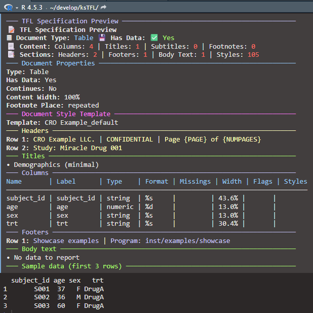

``` r
# End-to-end: wrap single spec into a report and render to DOCX
rpt_min_table <- create_report(spec_min_table)
write_doc(rpt_min_table, name = "tbl_min")
```

## 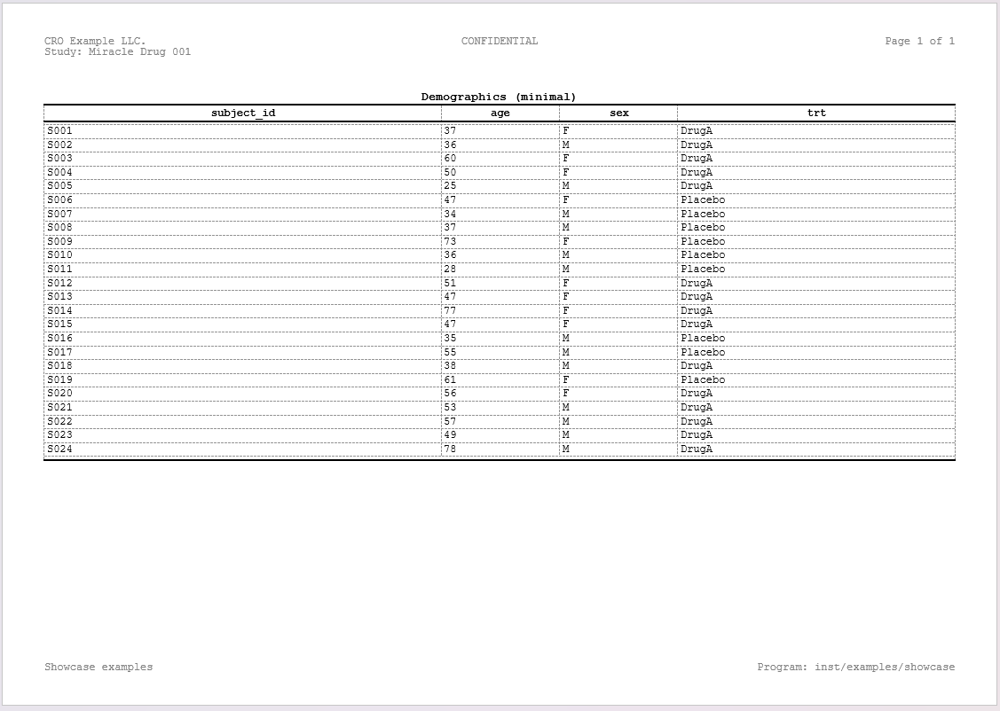

> **A note on the `cols` parameter** — The `cols` argument in
> [`create_table()`](https://example.com/reference/create_table.md)
> specifies which columns are rendered in the document and their
> left-to-right order. It acts purely as a *presentation directive*: the
> underlying data frame is stored in full, so columns omitted from
> `cols` are **not** dropped from the spec. They remain available for
> conditional logic in
> [`compute_cols()`](https://example.com/reference/compute_cols.md). For
> instance, you could exclude a helper column like `flag` from the
> report (`cols = c(subject_id, age, sex, trt)`) yet still reference
> `flag` in a
> [`compute_cols()`](https://example.com/reference/compute_cols.md)
> condition to drive styling or value transformations. This design means
> you never need to pre-filter or reorder your data frame before passing
> it to ksTFL — `cols` handles column selection and ordering in one
> place.

## 2 — Simple minimal figure

``` r
spec_min_fig <- create_figure(plot_file)
spec_min_fig <- add_title(spec_min_fig, "Example: Age vs SBP")
print(spec_min_fig)
# close example chunk
```

``` r
# End-to-end: render the single-figure report to DOCX
rpt_min_fig <- create_report(spec_min_fig)
write_doc(rpt_min_fig, name = "fig_min")
```

## 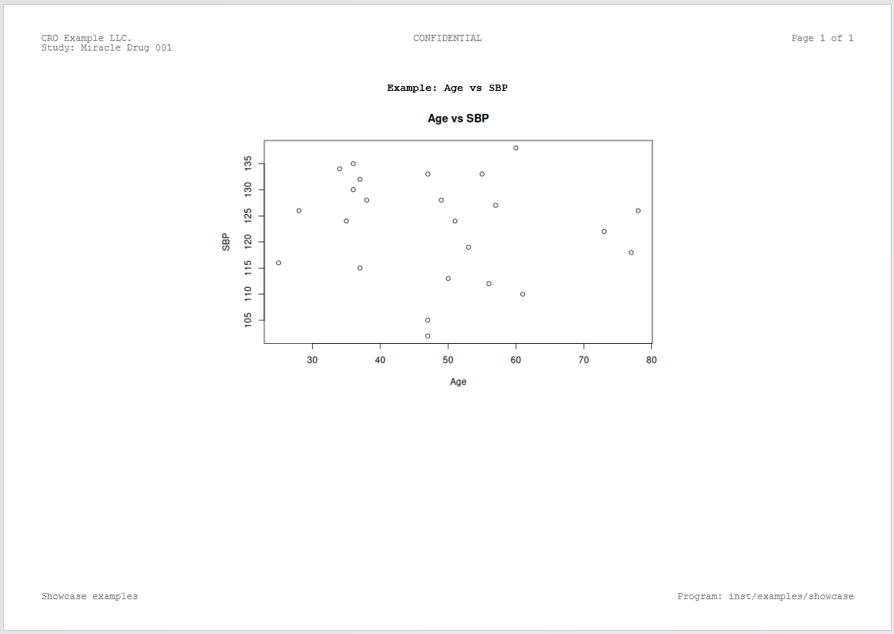

## 3 — Simple minimal text (narrative)

``` r
## Narrative object:
nartv <- list(
  subj = 'ABC-001',
  enrldt = '01JAN2022',
  compldt = '22JUN2022',
  discreas = 'Completed per protocol',
  nae = 3,
  listae = list('Nausea', 'Vomiting', 'Headache')
)

## Formatted text of the subject narrative:
text <- sprintf('The subject <b>%s</b> entered study %s and discontinued the study %s with a reason <i>"%s"</i>.<br>During the treatment period subject had the following %d AEs:<br><b>- %s</b>', 
        nartv[["subj"]],
        nartv[["enrldt"]],
        nartv[["compldt"]],
        nartv[["discreas"]],
        nartv[["nae"]],
        paste(nartv[["listae"]], collapse = '<br>- ')
)
```

``` r
# End-to-end: render the narrative report to DOCX
spec_min_text <- create_text() |> add_title("Sample Narrative Text")
spec_min_text <- add_body_text(spec_min_text, text)
rpt_min_text <- create_report(spec_min_text)
write_doc(rpt_min_text, name = "nar_min")
```

## 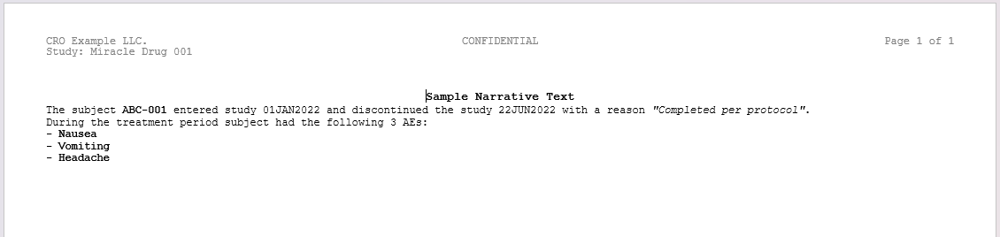

## 4 — Define columns: single, batch, and parameter recycling

### Why `define_cols()`?

After creating a table with
[`create_table()`](https://example.com/reference/create_table.md),
column properties are auto-detected from the data. However, you often
need to: - Customize column labels for readability - Specify numeric
formats (e.g., “%.2f” for 2 decimal places) - Control visibility,
styling, or special behaviors (ID column, deduplicate, page breaks) -
Lock or adjust column widths for better layout

[`define_cols()`](https://example.com/reference/define_cols.md) is the
primary tool for these customizations. It supports both
**single-column** and **batch updates**, with intelligent **parameter
recycling** to keep code concise.

### Example 1: Single column definition

The simplest case — modify one column at a time:

``` r
# Define one column
spec_single <- create_table(data = demog_tbl, cols = c(subject_id, age, sex, trt))
spec_single <- define_cols(spec_single, subject_id, label = "Subject ID", isID = TRUE)

# Another single column call (chaining is encouraged)
spec_single <- define_cols(spec_single, age, 
                           label = "Age (years)", 
                           type = "numeric", 
                           format = "%.0f")

print(spec_single)
# close example chunk
```

### Example 2: Batch update with single value (recycling to all columns)

Update multiple columns with the **same value** — the value is
automatically recycled:

``` r
# Apply single format to multiple columns
spec_batch <- create_table(data = vitals_tbl, cols = c(sbp, dbp))
spec_batch <- define_cols(spec_batch, c(sbp, dbp),
                          type = "numeric",      # Applied to both
                          format = "%.1f",       # Applied to both
                          valueStyleRef = "b")  # Applied to both

print(spec_batch)
# close example chunk
```

**Why this matters**: Instead of writing three separate
[`define_cols()`](https://example.com/reference/define_cols.md) calls,
you write one line and the package applies the same values to all
selected columns.

### Example 3: Batch update with per-column values (1-to-N mapping)

Update multiple columns with **different values** — provide a vector
matching the number of columns:

``` r
# Different label and format for each column
spec_mapped <- create_table(data = demog_tbl, cols = c(age, sex, trt)) |>
define_cols(c(age, sex, trt),
            label = c("Age (years)", "Biological Sex", "Treatment Group"),
            type = c("numeric", "string", "string"),
            format = c("%.0f", NA, NA) #format not applicable for strings -> NA
)

print(spec_mapped)
# close example chunk
```

**Important**: The vector length must match exactly:

\- Length 1: applies to all columns

\- Length N (where N = number of columns): applies one-to-one

\- Any other length: raises an error

### Example 4: Multiple `define_cols()` calls (chaining with `|>`)

Combine [`define_cols()`](https://example.com/reference/define_cols.md)
calls to layer customizations — each call merges with previous settings
(last-win strategy):

``` r
# Start with basic table
spec_chain <- 
  create_table(data = demog_tbl, cols = c(subject_id, age, sex, trt)) |>
# First pass: set all labels
  define_cols(c(subject_id, age, sex, trt),
             label = c("Subject ID", "Age", "Sex", "Treatment")) |>
# Second pass: set numeric formatting for age
  define_cols(age, type = "numeric", format = "%.0f") |>
# Third pass: mark subject_id as ID column (repeats on page breaks)
  define_cols(subject_id, isID = TRUE)

print(spec_chain)
# close example chunk
```

This approach makes it easy to:

\- Define labels first (human-readable column names)

\- Then apply formatting (numeric/string types, decimals)

\- Then apply special behavior flags (ID, deduplicate, etc.)

------------------------------------------------------------------------

## 5 — Set document properties (hasData, content width, placement)

**Key function**:
[`set_document()`](https://example.com/reference/set_document.md)

- `hasData`: Whether document contains data (important for Text specs)

\- `footnotePlace`: Control placement of titles, footnotes, and
subtitles

\- `contentWidth`: Content width (e.g., “100%”, “6.5in”, “16.51cm”)

\- `isContinues`: Ignore page breaks between sections

**Example 1: hasData flag**

``` r
spec <- create_table(demog_tbl) #automatically detects if dataframe has any rows
# When data frame does not have any rows, the report will show the default body_text placeholder instead of empty table. 
#body text can be manually specified

spec <- set_document(spec,
  hasData = FALSE) #override autodetected value

print(spec)
```

**Example 2: Content width and placement**

``` r
spec <- create_table(demog_tbl)

spec <- set_document(spec,
  contentWidth = "95%",        # Narrower content (default 100%)
  footnotePlace = "repeated")  # Footnotes on every page
```

**Notes**:

\- Most defaults are sensible; you typically only need
[`set_document()`](https://example.com/reference/set_document.md) for
content width

\- Multiple calls merge with last-win strategy (later calls override
earlier ones)

------------------------------------------------------------------------

## 6 — Combine table/figure/text into a single report

``` r
report_simple <- create_report(spec_min_table, spec_min_fig, spec_min_text)
```

``` r
# Render combined simple report to DOCX
write_doc(report_simple, name = "report_simple")
```

Notes:
[`create_report()`](https://example.com/reference/create_report.md)
preserves input order and consolidates styles. Additionally, with
`toc = TRUE` parameter the table of contents can be generated \[in order
this to work the titles in the input specs should be marked for toc
entries - see
[`?add_title`](https://example.com/reference/add_title.md)\]

------------------------------------------------------------------------

## 7 — Column widths: automatic calculation and locking

### How automatic column width works

When you create a table with
[`create_table()`](https://example.com/reference/create_table.md), ksTFL
automatically analyzes the data and distributes column widths
proportionally:

1.  **Initial analysis**: For each column, the package examines data
    values (length, type, number of decimals)
2.  **Width calculation**: Numeric columns typically get wider if they
    have many decimals or large values; short text columns get narrower
3.  **Proportional distribution**: All widths are normalized to sum to
    100% (or remaining available width)
4.  **Default**: `autoColWidth = TRUE` in package options (can be
    changed with
    [`tfl_set_options()`](https://example.com/reference/tfl_set_options.md))

**Example**: A table with columns `id` (short numeric), `description`
(long text), `value` (numeric): - Auto-detected widths might be:
`id = 20%`, `description = 50%`, `value = 30%`

### Example 1: Accept auto-calculated widths

The simplest approach — let the package handle width distribution:

``` r
# Create table; widths are auto-calculated from data characteristics
spec_auto <- create_table(data = labs_tbl, cols = c(subject_id, ALT, AST))
spec_auto <- define_cols(spec_auto, c(subject_id, ALT, AST),
                         label = c("Subject ID", "ALT (U/L)", "AST (U/L)"))

# Print to see auto-calculated widths
print(spec_auto)
```

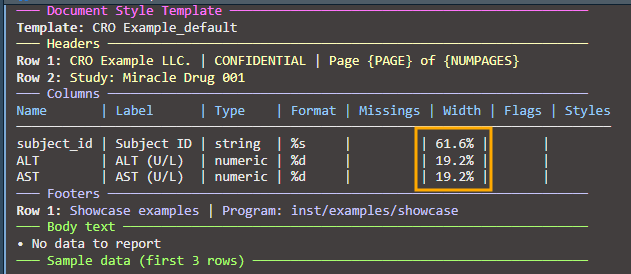

### Example 2: Lock one column, auto-adjust others

Lock a specific column width while others recalculate to fill remaining
space:

``` r
# Lock subject_id at 15%, let ALT and AST split the remaining 85%
spec_lock1 <- create_table(data = labs_tbl, cols = c(subject_id, ALT, AST))
spec_lock1 <- define_cols(spec_lock1, subject_id, 
                          label = "Subject ID",
                          colWidth = "15%")  # Lock at 15%

# When auto-recalculation runs (automatic), ALT and AST widths are recalculated
# to maintain their initial proportion while filling the remaining 85%

print(spec_lock1)
```

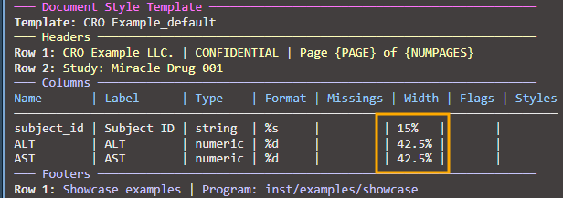

### Example 3: Lock multiple columns with relative widths

Lock several columns and let others auto-adjust:

``` r
# Lock two columns, let the third auto-adjust
spec_lock_multi <- create_table(data = labs_tbl, cols = c(subject_id, ALT, AST))
spec_lock_multi <- define_cols(spec_lock_multi, subject_id, 
                               label = "Subject ID",
                               colWidth = "12%")
spec_lock_multi <- define_cols(spec_lock_multi, ALT,
                               label = "ALT (U/L)",
                               colWidth = "40%")

# AST automatically fills remaining 48% (100% - 12% - 40%)

print(spec_lock_multi)
```

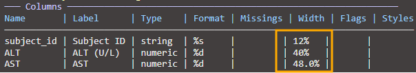

### Example 4: Mixed units (percentages and absolute)

Combine percentage-based widths with absolute units:

``` r
# Lock subject_id at 2 cm, others in percentages
spec_mixed <- create_table(data = labs_tbl, cols = c(subject_id, ALT, AST))
spec_mixed <- define_cols(spec_mixed, subject_id,
                          label = "Subject ID",
                          colWidth = "2cm")  # Absolute width
spec_mixed <- define_cols(spec_mixed, ALT,
                          label = "ALT (U/L)",
                          colWidth = "35%")   # Percentage of remaining

print(spec_mixed)
```

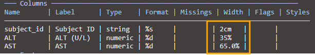

**Important**: When mixing units (cm, in, pt) with percentages, **the
absolute widths are reserved first**, then percentages are calculated
from remaining space.

### Example 5: Width validation and constraints

The package validates column widths to prevent invalid configurations:

``` r
spec_valid <- create_table(data = labs_tbl, cols = c(subject_id, ALT, AST))

# VALID: Set a reasonable relative width
spec_valid <- define_cols(spec_valid, ALT,
                          colWidth = "30%")  # OK: 30% is valid

# INVALID: Cannot set 100% relative width (leaves no space for other columns)
# This will raise an error:
# spec_valid <- define_cols(spec_valid, ALT, colWidth = "100%")
# Error: relative width 100.0% exceeds maximum allowed 75.0% 
#        (accounting for locked columns and minimum 0.5% for other columns)

# INVALID: Cannot set width below minimum threshold
# spec_valid <- define_cols(spec_valid, AST, colWidth = "0.2%")
# Error: relative width 0.2% is below minimum 0.5%

# Minimum width constraints (can be customized via package options):
# - Relative widths (%): minimum 0.5%
# - Fixed widths (cm, in, pt): minimum 0.2cm (~2mm, ~0.08in)

# Configure minimum width via package options:
tfl_set_options(minColWidth = 1.0)  # Set minimum relative width to 1.0%

# Now 0.5% will fail, but 1.0% will succeed
spec_valid <- define_cols(spec_valid, AST,
                          colWidth = "1.0%")  # OK with new minimum

print(spec_valid)
```

**Width validation rules**:

\- **Relative width (%)**: Must be ≥ `minColWidth` (default 0.5%)

\- **Relative width (%)**: Cannot exceed max allowed considering locked
columns and other column minimums

\- **Fixed width**: Must be ≥ 0.2cm (all units: cm, in, pt, mm
automatically converted)

\- **Incompatible widths**: Cannot set width to 100% (would exclude all
other columns)

**Error messages** are detailed and show the maximum allowed width when
you exceed limits:

    Error: relative width 100.0% exceeds maximum allowed 75.0% 
           (accounting for 2 locked columns requiring 25% total, 
            and minimum 0.5% for remaining 1 unlocked column)

------------------------------------------------------------------------

## 8 — Table with titles, subtitles and footnotes

``` r
spec_multi <- create_table(data = labs_tbl, cols = c(subject_id, ALT, AST))
spec_multi <- add_title(spec_multi, "Laboratory Results")
spec_multi <- add_subtitle(spec_multi, "Selected hepatic enzymes by subject")
spec_multi <- add_footnote(spec_multi, "Values are shown as observed.")

spec_multi <- define_cols(
  spec_multi,
  c(subject_id, ALT, AST),
  label = c("Subject ID", "ALT (U/L)", "AST (U/L)")
)

print(spec_multi)
# close example chunk
```

``` r
# Render the multilevel table to DOCX
rpt_multi <- create_report(spec_multi)
write_doc(rpt_multi, name = "tbl_multi")
```

## 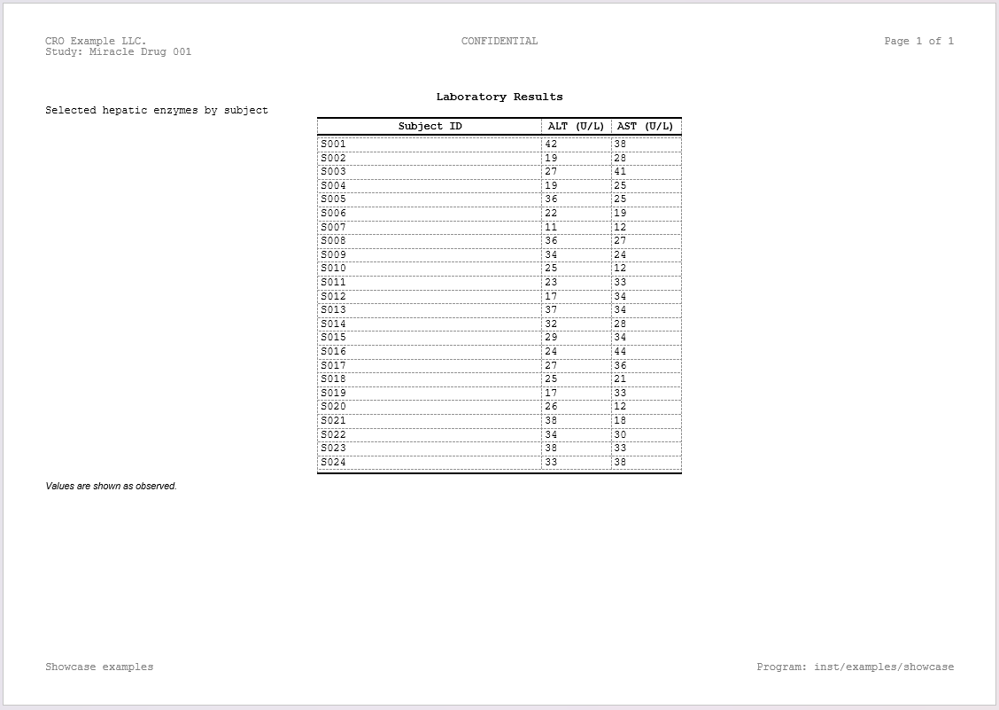

## 9 — span columns (spanning headers)

### Why spanning headers?

In clinical tables, you often need to group related columns under a
common header. For example: - “Baseline” spanning columns: `visit`,
`sbp`, `dbp`, `pulse` - “Week 12” spanning columns: `sbp`, `dbp`,
`pulse` (repeated measurements at different visits)

Spanning headers (called “spans” in ksTFL) are separate from column
labels — they sit above the column labels and group multiple columns.
Multiple spans can be stacked at different vertical levels.

### Example 1: Single spanning header

Create one stub that groups related columns:

``` r
# Start with demographics table
spec_span_simple <- create_table(data = demog_tbl, cols = c(subject_id, age, sex, trt))
spec_span_simple <- define_cols(spec_span_simple, 
                                c(subject_id, age, sex, trt), 
                                label = c("Subject","Age","Sex","Treatment"))

# Add a spanning header for "Demographics" above age and sex
spec_span_simple <- add_span_header(spec_span_simple, 
                                    cols = c("age", "sex"), 
                                    label = "Demographics")

print(spec_span_simple)
```

**Result**: A table with column labels on one row and a “Demographics”
header spanning age+sex columns above it:  
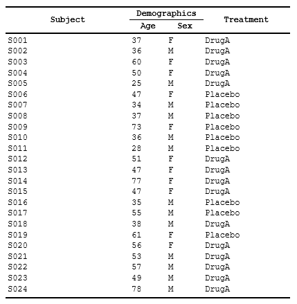

### Example 1b: Using tidyselect helpers with spanning headers

[`add_span_header()`](https://example.com/reference/add_span_header.md)
supports all tidyselect expressions — use helpers for flexible column
selection:

``` r
# Table with mixed column types
mixed_data <- data.frame(
  id = 1:10,
  age_baseline = rnorm(10, 45, 10),
  age_follow = rnorm(10, 46, 10),
  weight_baseline = rnorm(10, 70, 10),
  weight_follow = rnorm(10, 71, 10)
)

spec_tidysel <- create_table(mixed_data)

# Using starts_with() helper
spec_tidysel <- add_span_header(spec_tidysel, 
                                cols = starts_with("age"),
                                label = "Age Measurements",
                                stubOrder = 1) |>
# Using col position 
add_span_header(cols = c(4,5),
               label = "Weight Measurements",
               stubOrder = 1) |>
# Using negation (-) to exclude columns
add_span_header(cols = -id,
                label = "Baseline and Follow",
                stubOrder = 2)

print(spec_tidysel)
```

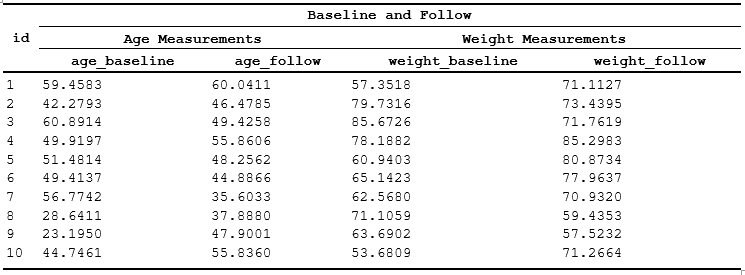

**Tidyselect expressions supported**:

\- **Ranges**: `cols = age:weight` (all columns between age and weight)

\- **Helpers**: `cols = starts_with("age")`, `contains("baseline")`,
`matches("^w")`

\- **Negation**: `cols = -id` (all columns except id)

\- **Combinations**: `cols = c(starts_with("age"), weight_baseline)`

### Example 2: Styled spanning headers

Apply styles to stub labels using `labelStyleRef`:

``` r
# First, create a style for stub labels
spec_spans_style <- create_table(data = demog_tbl, cols = c(subject_id, age, sex, trt))

spec_spans_style <- add_style(spec_spans_style, 
                              id = "span_header",
                              s_font(bold = TRUE, font_size = "12pt"),
                              s_paragraph(alignment = "center"),
                              s_table_style(background_color = "#E8E8E8"))

# Define columns
spec_spans_style <- define_cols(spec_spans_style,
                                c(subject_id, age, sex, trt),
                                label = c("Subject ID", "Age", "Sex", "Treatment"),
                                valueStyleRef = 'ac')

# Add span with style reference
spec_spans_style <- add_span_header(spec_spans_style,
                                    cols = c("age", "sex"),
                                    label = "Demographics",
                                    labelStyleRef = "span_header")
```

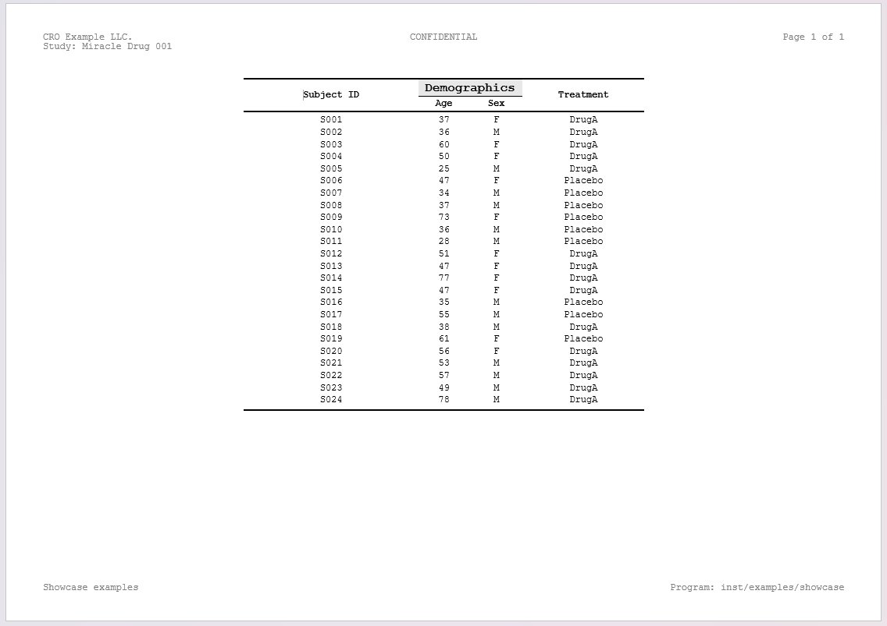

Notes:

\- `labelStyleRef` can be a single style name or multiple styles
combined with
[`f_combine()`](https://example.com/reference/f_combine.md)

\- Span labels inherit the applied style, making grouped columns
visually distinct

\- Styles must be defined before referencing them in
[`add_span_header()`](https://example.com/reference/add_span_header.md)

### Example 3: Paragraph borders on spanning headers

When a cell border is applied to a spanning header, it stretches across
the entire merged cell. A paragraph border instead follows the text
width — useful for visually separating groups without a full-width line.
Paragraph borders are also unaffected by structural border overrides
(`header_top_border`, `header_bottom_border`), giving full control on
intermediate header rows.

``` r
spec_para <- create_table(data = demog_tbl, cols = c(subject_id, age, sex, trt))

# Paragraph border style — the underline follows the text, not the cell edge
spec_para <- add_style(spec_para, id = "span_underline",
  s_font(bold = TRUE),
  s_paragraph(
    alignment = "center",
    borders = s_borders(
      bottom = s_border(color = "#000000", width = "0.5pt", line_style = "single")
    )
  )
)

# Or use the built-in paragraph border atom
spec_para <- add_span_header(spec_para,
  cols = c("age", "sex"),
  label = "Demographics",
  labelStyleRef = f_combine("b", "ac", "pb_th")  # bold + center + thin paragraph bottom border
)
```

``` r
# Render stubbed table report to DOCX
rpt_stub <- create_report(spec_stubs_style)
write_doc(rpt_stub, name = "tbl_stub", outDir = "./out", metaPath = tempdir())
```

------------------------------------------------------------------------

## 10 — Styles and `f_combine()` for combined style references

### Why named styles?

Styles are foundational in professional reporting:

\- Define once, reference many times — consistency across your document

\- Easy to update: change one style definition and all references
automatically pick up the change

\- Composable: combine base styles (bold, red text) into complex styles
for specific use cases

ksTFL uses a **named style system**: you define styles with
[`add_style()`](https://example.com/reference/add_style.md) giving each
an `id`, then reference them by name wherever you need them
(`labelStyleRef`, `valueStyleRef`, `labelStyleRef` in stubs, etc.).

### Example 1: Define base styles

Create atomic styles that focus on one aspect (font, alignment, color):

``` r
# Create a table spec
spec_base_styles <- create_table(data = demog_tbl, cols = c(subject_id, age, sex, trt))

# Define reusable base styles
spec_base_styles <- add_style(spec_base_styles, id = "bold_header",
                              s_font(bold = TRUE, font_size = "12pt"))

spec_base_styles <- add_style(spec_base_styles, id = "right_align",
                              s_paragraph(alignment = "right"))

spec_base_styles <- add_style(spec_base_styles, id = "light_gray_bg",
                              s_table_style(background_color = "#F5F5F5"))

# Apply to columns
spec_base_styles <- define_cols(spec_base_styles,
                                c(subject_id, age, sex, trt),
                                label = c("Subject ID", "Age", "Sex", "Treatment"),
                                labelStyleRef = c("bold_header", "", "", ""))

print(spec_base_styles)
# close example chunk
```

### Example 2: Combine styles with `f_combine()`

Apply multiple styles to a single element using
[`f_combine()`](https://example.com/reference/f_combine.md) — they merge
at render time:

``` r
# Create spec and define base styles
spec_combined <- create_table(data = demog_tbl, cols = c(subject_id, age, sex, trt))

# Define atomic styles
spec_combined <- add_style(spec_combined, id = "bold_text", s_font(bold = TRUE))
spec_combined <- add_style(spec_combined, id = "red_color", s_font(color = "#CC0000"))
spec_combined <- add_style(spec_combined, id = "centered", s_paragraph(alignment = "center"))

# Combine styles: bold + red text + centered
spec_combined <- define_cols(spec_combined,
                             subject_id,
                             label = "Subject ID",
                             labelStyleRef = f_combine("bold_text", "red_color", "centered")) |>

define_cols(c(sex, trt),
            label=c('Sex', 'Treatment'),
            labelStyleRef = f_combine('b','i'),
            valueStyleRef = f_combine('ar', 'i')
            ) |>
# Different columns can use different combinations
define_cols(age, label = "Age",
            labelStyleRef = f_combine("bold_text", "centered"),
            valueStyleRef = 'ac')
```

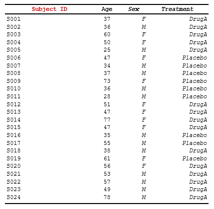

**How [`f_combine()`](https://example.com/reference/f_combine.md)
works**:

\- Takes multiple style names as arguments

\- Returns a reference object that tells the package to merge those
styles

\- Order matters for last-win conflict resolution (later arguments
override earlier ones)

## 11 — Conditional row actions with `compute_cols()`

**Overview**: While
[`define_cols()`](https://example.com/reference/define_cols.md) sets
properties globally for all rows,
[`compute_cols()`](https://example.com/reference/compute_cols.md)
applies **conditional actions** to specific rows matching a condition.

Common use cases:

\- Style rows where a specific value occurs (e.g., first/last
occurrence, threshold-based)

\- Merge columns in certain rows (e.g., group headers)

\- Insert separator or summary rows programmatically

### Example 1: Conditional styling

Apply a style to columns in rows matching a condition:

``` r
# Sample data with groups
data <- data.frame(
  group = c("A", "A", "B", "B", "C"),
  metric = c("Value 1", "Value 2", "Value 3", "Value 4", "Value 5"),
  count = c(10, 20, 15, 25, 30)
)

# Create spec and define styles
spec <- create_table(data) |>
  add_style(id = "group_header", s_font(bold = TRUE, color = "#0000FF")) |>
  add_style(id = "emphasize",    s_table_style(background_color = "#FFFFCC"))

# Apply conditional styling: bold+blue for first occurrence of each group
spec <- spec |>
  compute_cols(firstOf(group), c_style(c(metric, count), styleRef = "group_header"))

# Apply conditional styling: highlight rows with high count
spec <- spec |>
  compute_cols(count > 20, c_style(count, styleRef = "emphasize"))
```

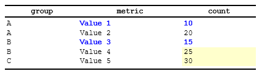

### Example 2: Combining styles in conditional rows

Apply multiple styles to a single column using
[`f_combine()`](https://example.com/reference/f_combine.md):

``` r
spec <- create_table(data) |>
  add_style(id = "bold",      s_font(bold = TRUE)) |>
  add_style(id = "large",     s_font(font_size = "14pt")) |>
  add_style(id = "highlight", s_table_style(background_color = "#FFFF00"))

# Apply combined styles to first group occurrence
spec <- spec |>
  compute_cols(firstOf(group), 
    c_style(metric, styleRef = f_combine("bold", "large", "highlight"))
  )
```

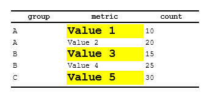

### Example 3: Column merging in conditional rows

Merge adjacent columns for rows matching a condition:

``` r
spec <- create_table(data) |>
  add_style(id = "group_label", s_table_style(background_color = "#D9D9D9"))

# Merge metric and count columns for first occurrence (group header style)
spec <- spec |>
  compute_cols(firstOf(group), 
    c_merge(c(metric, count), styleRef = "group_label")
  )
```

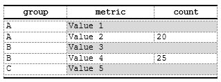

### Example 4: Inserting separator rows

Insert empty rows (separators) or rows with content from another column:

``` r
spec <- create_table(data) |>
  add_style(id = "separator", s_table_style(background_color = "#E8E8E8"))

# Insert empty separator above first group occurrence
spec <- spec |>
  compute_cols(firstOf(group), 
    c_addrow(pos = "above")  # Empty row, no value_from
  )

# Insert summary row below last group occurrence (using a specific column as content)
spec <- spec |>
  compute_cols(lastOf(group), 
    c_addrow(pos = "below", value_from = "group", styleRef = "separator")
  )
```

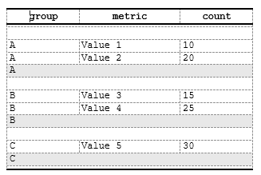

### Example 4b: Page break insertion

Force a page break when a group ends (useful for long groups):

``` r
spec <- spec |>
  compute_cols(lastOf(group),
    c_pageBreak()
  )
```

### Example 5: Multiple actions on same rows

Combine styling, merging, and row insertion in a single
[`compute_cols()`](https://example.com/reference/compute_cols.md) call:

``` r
spec <- create_table(data) |>
  add_style(id = "header",    s_font(bold = TRUE)) |>
  add_style(id = "separator", s_table_style(background_color = "#E8E8E8"))

# For first group occurrence: add separator, style, and merge
spec <- spec |>
  compute_cols(firstOf(group), 
    c_addrow(pos = "above"),  # Add empty separator
    c_style(metric, styleRef = "header"),  # Style metric column
    c_merge(c(metric, count))  # Merge adjacent columns
  )
```

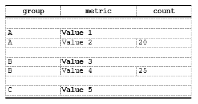

**Key concepts**:

\- **Conditions** are unevaluated expressions evaluated at report
generation time (during
[`create_report()`](https://example.com/reference/create_report.md))

\- **Helper functions** (`firstOf()`, `lastOf()`, `firstRow()`,
`lastRow()`, `rowNumber()`, `everyNth()`, `firstOfBlock()`) are only
available inside
[`compute_cols()`](https://example.com/reference/compute_cols.md)
conditions — they are **not** standalone exported functions. See
[`vignette("Advanced_StyleRows")`](https://example.com/articles/Advanced_StyleRows.md)
for full details.

\- **Multiple calls accumulate**: calling
[`compute_cols()`](https://example.com/reference/compute_cols.md)
multiple times on the same spec appends actions

\- **Multiple actions in one call**: same row can have styling, merging,
and row insertion simultaneously

\- **Overlapping conditions**: if multiple conditions match the same
row, all actions apply (styling aggregates, merging rules apply) -
**value_from**: Optional in
[`c_addrow()`](https://example.com/reference/c_addrow.md) — omit for
empty separator rows

\- **Performance**: Conditions evaluated once per row during report
assembly; style consolidation happens automatically

------------------------------------------------------------------------

## 12 — Render to DOCX with `write_doc()`

### What `write_doc()` does

[`write_doc()`](https://example.com/reference/write_doc.md) is the
primary output function. It combines two lower-level steps into one:

1.  **Validates and serializes** the report to JSON, writing metadata
    and data files to `metaPath`
2.  **Renders** the JSON to a DOCX file in `outDir`

&nbsp;

    create_report() → write_doc()  →  output.docx

### Example: Assemble and render a multi-spec report

> **Tip**: Use
> [`tfl_list_templates()`](https://example.com/reference/tfl_list_templates.md)
> to discover available template names (e.g., `"Navy_Pro"`,
> `"Carbon_Dark"`). Use
> [`run_styles_editor()`](https://example.com/reference/run_styles_editor.md)
> to interactively preview and customize templates.

``` r
# Create multiple specs
table_spec <- create_table(data = labs_tbl, cols = c(subject_id, ALT, AST))
table_spec <- add_title(table_spec, "Laboratory Results")
table_spec <- set_page_style(table_spec, docTemplate = "Navy_Pro")

text_spec <- create_text()
text_spec <- add_body_text(text_spec, "All values are from the locked database.")
text_spec <- set_page_style(text_spec, docTemplate = "Carbon_Dark")

# Assemble into report
report_full <- create_report(table_spec, text_spec)

# A) Per-spec templates (default): each spec uses its own docTemplate
write_doc(report_full, name = "example_report", outDir = "./out", metaPath = tempdir())

# B) Global override: force one template for all specs
write_doc(
  report_full,
  name = "example_report_global_override",
  outDir = "./out",
  metaPath = tempdir(),
  overrideTemplate = system.file("templates", "Navy_Pro.json", package = "ksTFL", mustWork = TRUE)
)
```

In this workflow:

- `write_doc(..., overrideTemplate = NULL)` keeps per-spec `docTemplate`
  styling.
- `write_doc(..., overrideTemplate = <name_or_path>)` applies a single
  global template to all specs.

**Key parameters**: - `report`: A `TFL_report` object (created via
[`create_report()`](https://example.com/reference/create_report.md)) -
`name`: Base name for the output DOCX (e.g. `"example_report"` →
`example_report.docx`) - `outDir`: Directory where the output DOCX is
written - `metaPath`: Directory where intermediate JSON and data files
are written

**Advanced**: If you need to inspect the JSON before rendering (e.g. for
debugging or CI pipelines), you can split the call into
[`save_report()`](https://example.com/reference/save_report.md) +
[`replay_report()`](https://example.com/reference/replay_report.md). See
[`?write_doc`](https://example.com/reference/write_doc.md) and
[`?replay_report`](https://example.com/reference/replay_report.md) for
details.

------------------------------------------------------------------------

## 13 — Session-wide `tfl_options`: common headers/footers and default body text

### Why session options?

In a real clinical reporting workflow, many tables/listings share: -
Common headers (study name, database version, confidentiality notice) -
Common footers (company name, page numbers, disclaimers) - Default body
text (standard disclaimers or methodology notes)

Instead of adding these to every spec, use
[`tfl_set_options()`](https://example.com/reference/tfl_set_options.md)
to set session defaults once. All specs created afterward inherit these
settings.

### Example 1: Set basic session options

``` r
# Set session defaults (applies to all NEW specs created after this call)
tfl_set_options(
  add_header("Study ABC", "Phase II Safety Study", "CONFIDENTIAL"),
  add_footer("Company Confidential", "Page {PAGE} of {NUMPAGES}")
)

# Create spec — automatically inherits headers/footers from options
spec_with_opts <- create_table(data = demog_tbl, cols = c(subject_id, age, sex, trt))
spec_with_opts <- add_title(spec_with_opts, "Demographics Table")

print(spec_with_opts)
# close example chunk
```

**Key point**: Headers and footers from
[`tfl_set_options()`](https://example.com/reference/tfl_set_options.md)
are automatically applied to new specs. No need to call
[`add_header()`](https://example.com/reference/add_header.md) again.

### Example 2: Override session options in a specific spec

You can override session defaults on individual specs:

``` r
# Session options are still in effect from previous example

# Create a spec with session defaults
spec_default <- create_table(data = labs_tbl, cols = c(subject_id, ALT, AST))
spec_default <- add_title(spec_default, "Lab Results (using session defaults)")

# Create another spec but override the header
spec_override <- create_table(data = demog_tbl, cols = c(subject_id, age))
spec_override <- add_header(spec_override, "Study XYZ", "Different Study", "CONFIDENTIAL")  # Overrides session default
spec_override <- add_title(spec_override, "Demographics (custom header)")

print(spec_default)   # Uses session header from tfl_set_options
print(spec_override)  # Uses custom header from add_header call
# close example chunk
```

**Rule**: Spec-level settings always take precedence over session
defaults (last-win strategy).

### Example 3: Check and reset session options

Inspect current session options and reset to defaults:

``` r
# Check current options
current_options <- tfl_get_options()
str(current_options)

# Get a single option
current_missings <- tfl_get_option("missings")
cat("Current missings representation:", current_missings, "\n")

# Reset to package defaults
tfl_reset_options()

# Now new specs will use package defaults instead of your custom session options
spec_reset <- create_table(data = demog_tbl, cols = c(subject_id, age))
print(spec_reset)
# close example chunk
```

------------------------------------------------------------------------

## Final notes

This comprehensive vignette demonstrates the complete ksTFL reporting
pipeline using only exported helpers.

**Examples covered**: 1. Minimal table/figure/text creation (single-spec
workflows) 2. **Define columns**: Single column, batch updates,
parameter recycling (NEW) 3. Column widths: Auto-calculation, locking,
mixed units (NEW) 4. Multi-level tables with titles, subtitles, and
footnotes 5. Combining multiple specs into a report 6. Spanning headers
(stub columns) with styling 7. Named styles and combining with
[`f_combine()`](https://example.com/reference/f_combine.md) (expanded)
8. End-to-end render with
[`write_doc()`](https://example.com/reference/write_doc.md) 9. Session
defaults with
[`tfl_set_options()`](https://example.com/reference/tfl_set_options.md)

**Key patterns to remember**: - **Batch operations**: Use
[`c()`](https://rdrr.io/r/base/c.html) to select multiple columns,
provide single values (recycled) or N values (one-to-one mapping) -
**Multiple calls**: Chain
[`define_cols()`](https://example.com/reference/define_cols.md),
[`add_style()`](https://example.com/reference/add_style.md), etc. — each
call merges with previous settings - **Flexible column widths**:
Auto-calculated by default; lock specific columns with `colWidth` to
trigger recalculation of others - **Combining styles**: Use
[`f_combine()`](https://example.com/reference/f_combine.md) for
on-the-fly combinations; define named styles for reuse - **Session
defaults**: Use
[`tfl_set_options()`](https://example.com/reference/tfl_set_options.md)
once; all new specs inherit settings (override per-spec if needed)

**Running examples locally**: Set the top chunk `eval=TRUE` to generate
sample data, then execute examples in order. All code uses exported
functions only — no internal API manipulation needed.

For more details on function parameters, see the roxygen documentation:
[`?create_table`](https://example.com/reference/create_table.md),
[`?define_cols`](https://example.com/reference/define_cols.md),
[`?add_style`](https://example.com/reference/add_style.md),
[`?write_doc`](https://example.com/reference/write_doc.md), etc.
